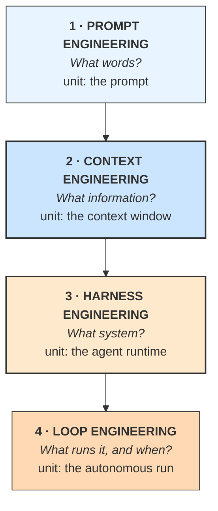

# **Module 1, Lesson 4: The Four Disciplines — A Map of the Field**

### Building on What We've Learned

You now have the vocabulary and the principles. Before we go deep, here's the map — because the field reorganized itself substantially between 2023 and 2026, and knowing the shape of it makes the rest of this course cohere rather than feel like a list of tricks.

This lesson has no new technique in it. It's the diagram you'll want to have in your head for the next seven modules.

### Learning Objectives

By the end of this lesson, you will be able to:
*   **Name** the four disciplines and the question each one answers.
*   **Diagnose** which discipline a given problem belongs to.
*   **Navigate** this course by mapping each module to a discipline.

---

### **1. Four Questions, Four Disciplines**

Each discipline emerged when the previous one stopped being sufficient. None of them replaced its predecessor — each **contains** the one before it.

| | Asks | Unit of work | You change it by | Emerged |
| :--- | :--- | :--- | :--- | :--- |
| **Prompt engineering** | What words produce this behavior? | One prompt | Editing text | 2022–2023 |
| **Context engineering** | What information produces this behavior? | The context window, every turn | Writing assembly code | 2024–2025 |
| **Harness engineering** | What system makes this failure impossible? | The agent runtime | Adding structure — checks, schemas, scopes | 2026 |
| **Loop engineering** | What finds the work and verifies it's done? | An autonomous run | Designing triggers, goals, termination | 2026 |

**The progression follows a single trend:** control moves out of the model's discretion and into code you can test. A prompt asks the model to behave. A harness makes misbehavior structurally impossible. That's the arc of the whole field, and of this course.

---

### **2. Which Discipline Is Your Problem?**

This is the practically useful part. When something goes wrong, misdiagnosing the discipline sends you tuning prompts for a week on a problem that needed twenty lines of code.

| Symptom | Discipline | Typical fix |
| :--- | :--- | :--- |
| Output in the wrong format or tone | **Prompt** | Clearer instructions, a canonical example |
| Confidently wrong facts | **Context** | Better retrieval, grounding rules, citations |
| Ignores instructions in long conversations | **Context** | Compaction; restate the task at the end |
| Picks the wrong tool | **Context** (tool descriptions are context) | Prune overlapping tools; sharpen descriptions |
| Claims it finished without checking | **Harness** | External verification gates termination |
| Costs 10× the estimate | **Context + Harness** | Cache-aware ordering, model routing, budget caps |
| Did something it shouldn't be able to do | **Harness** | Permission scoping, sandboxing |
| Works when you run it, useless unattended | **Loop** | Triggers, verifiable goal, escalation path |

> **The most common misdiagnosis by a distance:** treating a harness problem as a prompt problem. "The agent keeps claiming it's done" gets answered with *"ALWAYS verify your work before claiming completion"* in the system prompt. That helps a little, inconsistently, forever. The fix is a test runner in the loop that decides whether the task is complete — and it works every time, on every model.
>
> **The heuristic:** if you're adding another sentence to a prompt to prevent a failure that has already happened twice, stop. You need structure, not words.

---

### **3. How This Course Maps**

| Modules | Discipline | What you'll build toward |
| :--- | :--- | :--- |
| **1–2** | Prompt → Context | Principles, altitude, prompting techniques |
| **3–4** | Context | Retrieval, ranking, compression, compaction, memory |
| **5** | Context → Harness | Tools, MCP, skills, agent architectures |
| **6** | Harness | Evaluation, tracing, security |
| **7** | — | The frontier: multi-modal agents, standards, ethics |
| **8** | Harness + Loop | The harness, loops, AI teams, agentic architecture |

Modules 1–4 are the deepest treatment, and that's deliberate rather than historical: **every later discipline is bottlenecked by context quality.** A perfect harness around an agent fed noisy context produces reliable delivery of bad answers.

---

### **4. What Doesn't Change**

Techniques churn. Frameworks churn faster. Four things have held across every model generation so far, and they're what to actually internalize:

1.  **Context is finite and degrades.** Every technique in Modules 3 and 4 exists because of this one fact.
2.  **Verification must live outside the agent.** A system that grades its own homework will pass.
3.  **Capability must be scoped.** What an agent *can* do bounds what can go wrong — including what an attacker can make it do.
4.  **You can't improve what you can't measure.** Without evals, every change is a guess with a confident narrator.

Everything else in this course is an implementation of one of those four.

---

### **Key Takeaways**

*   Four disciplines, each containing the last: **prompt → context → harness → loop.**
*   The arc is control moving **out of the model's discretion and into testable code.**
*   **Diagnose the discipline before fixing the problem.** Most wasted effort is prompt-tuning a harness problem.
*   If you're adding a sentence to prevent a failure that's happened twice, **you need structure, not words.**
*   Four durable truths: context degrades, verification must be external, capability must be scoped, unmeasured change is guessing.

### **Hands-On Task: Diagnose the Discipline**

For each symptom, name the discipline, the likely fix, and — importantly — the **wrong fix** someone would plausibly reach for first.

1.  A summarizer produces good summaries but sometimes in bullets and sometimes in prose.
2.  A research agent gives excellent answers for the first ten minutes of a session and noticeably worse ones after thirty.
3.  A support bot confidently quotes a refund policy your company retired last year.
4.  A coding agent opens a pull request saying "all tests pass." Tests were never run.
5.  A nightly report agent works perfectly when you run it by hand, and produces nothing three nights out of five.
6.  An agent with fifteen tools keeps calling `search_docs` when it should call `search_tickets`.
7.  Your monthly bill is 8× the estimate. Traces show the same 3,000-token system prompt billed at full input rate on every one of 40 turns.

For **two** of these, also write the sentence someone would add to the system prompt to "fix" it — and explain in one line why that sentence won't hold.
