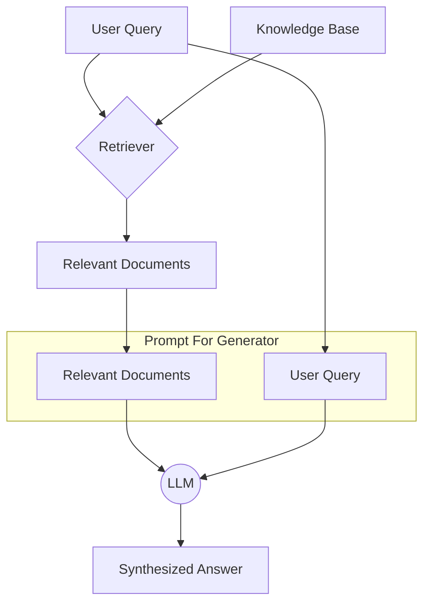

# **Module 3, Lesson 1: Introduction to Retrieval-Augmented Generation (RAG)**

### Building on What We've Learned

In Module 2, we mastered the art of prompting. But even the best prompt is useless if the model doesn't have the right information. This module introduces the most important architecture for solving that problem: **Retrieval-Augmented Generation (RAG)**.

### Learning Objectives

By the end of this lesson, you will be able to:
*   **Explain** what RAG is and why it addresses knowledge cutoffs and hallucinations.
*   **Draw** the RAG architecture, labeling the Retriever and the Generator.
*   **List** the three primary benefits: real-time data access, reduced hallucinations, and verifiability.
*   **Assemble** a prompt showing how a Generator uses retrieved context.
*   **Position** RAG correctly as *one* retrieval strategy among several, not the default answer.

---

### **1. The Problem: The "Closed-Book" Exam**

Imagine an incredibly smart student who is about to take an exam. There's a catch: they read every book in the library, but their studying stopped a year ago.

*   **Knowledge Cutoff:** They can't answer questions about recent history or new discoveries.
*   **Proprietary Knowledge:** They never saw your company's private meeting notes, so they can't answer questions about them.
*   **Hallucination:** If you ask them a question they don't know, they might try to guess based on older, related information, leading to a confidently wrong answer.

An LLM by itself is this student. It's taking a "closed-book" exam based only on its training data.

**RAG is the "open-book" exam.** Instead of just asking the student a question, we first go to a library, find the specific books and pages that contain the answer, and hand them to the student. We then say, "Answer the question using *only* these documents."

---

### **2. The Core Architecture: Retrieve, then Generate**

A RAG system has two core components:

**A. The Retriever (The Librarian)**
*   **Job:** To find and fetch relevant information from a knowledge base (a collection of your documents, website data, PDFs, etc.).
*   **Process:** When a user asks a question, the retriever searches the knowledge base for the most relevant snippets of text. It doesn't answer the question itself; it just finds the raw material that *should* contain the answer.

**B. The Generator (The Smart Student)**
*   **Job:** To synthesize a natural language answer based on the information provided by the Retriever.
*   **Process:** This is the LLM (e.g., GPT-4). It receives a prompt containing both the original user question and the relevant snippets found by the Retriever. Its task is to formulate an answer grounded in the provided context.

**Diagram: The Flow of a RAG Query**


---

### **3. Why RAG is a Cornerstone of Modern AI**

RAG is transformative for three key reasons:

1.  **Access to Real-Time & Private Data:** You can build a Q&A bot over your company's internal wiki, a support bot that knows your latest product specs, or a research assistant that can read today's news. The LLM doesn't need to be trained on this data; it just needs to be able to read it in the prompt.

2.  **Drastic Reduction in Hallucinations:** By instructing the model to answer *only* based on the provided text, we ground it in fact. A typical RAG system prompt includes the rule: `"If the answer is not found in the provided context, say 'I do not have enough information to answer that question.'"` This gives the model an "out" so it doesn't feel compelled to guess.

3.  **Verifiability and Trust:** Because you know exactly which documents were retrieved to generate an answer, you can cite your sources (e.g., "According to `document.pdf`, page 8..."). This allows users to verify the information for themselves, which is critical for building trust in your application.

---

---

### **4. A Note on Scope: RAG Is a Strategy, Not the Default**

One clarification before we spend three lessons on the machinery, because it will save you from over-applying it.

"RAG" in common usage means something quite specific: **chunk documents, embed them, store the vectors, retrieve by semantic similarity.** That pipeline is excellent for a particular shape of problem — a large corpus of unstructured text, queried in fuzzy natural language, where the right answer is "the passage that is semantically closest."

It is *not* the only way to get information into a context window, and by 2026 it stopped being the automatic answer:

*   If your data is **structured**, query it. A SQL query against your orders table beats embedding your orders table, every time.
*   If your corpus is **code or a filesystem**, agentic search — `glob`, `grep`, read, follow the imports — generally outperforms vector retrieval. Lesson 5 covers why.
*   If the answer lives behind an **API**, call the API. A tool that returns today's inventory beats a vector index of last week's.
*   If the corpus is **small enough**, just include it. Retrieval infrastructure to search four documents is engineering theatre.

The broader skill this module is really teaching is **grounding**: making a model answer from supplied evidence rather than from memory. Vector RAG is one implementation of grounding. Learn it thoroughly — it's the right tool often — and learn its edges, which is what Lesson 5 is for.

---

### **Key Takeaways**

*   RAG turns a "closed-book" exam into an "open-book" one, letting a model answer about recent, private, or specialized topics.
*   Two components: the **Retriever** finds relevant material, the **Generator** writes a grounded answer.
*   RAG's three benefits are **real-time/private data access, reduced hallucination, and verifiability through citations.**
*   RAG is **one grounding strategy**. Structured data wants a query, code wants agentic search, live data wants an API, and a tiny corpus wants no retrieval at all.

### **Hands-On Task: Design a RAG Prompt**

**Scenario:**
Imagine a `Retriever` has already found a chunk of text from a fictional employee handbook. Now you need to design the prompt for the `Generator` (the LLM).

**Retrieved Context:**
```
Source: "employee_handbook.pdf", page 12
Title: "Time Off Policy"
Content: "Full-time employees receive 20 days of Paid Time Off (PTO) per year. PTO accrues at a rate of 1.67 days per month. Unused PTO can be rolled over, up to a maximum of 10 days. New employees start with a balance of 0 days and begin accruing PTO on their first day."
```

**User's Question:**
"How much vacation time do I get, and can I save it for next year if I don't use it?"

**Your Task:**
Write a complete system prompt that will be sent to the Generator. It should:
1.  Define a clear **Persona** (e.g., "You are a helpful HR assistant...").
2.  Include a **Rule** that the model must answer *only* using the provided context and must state if the answer isn't present.
3.  Include a **Rule** that it must cite its source.
4.  Combine the persona, rules, the `Retrieved Context`, and the `User's Question` into a single, well-structured prompt ready for the LLM. 