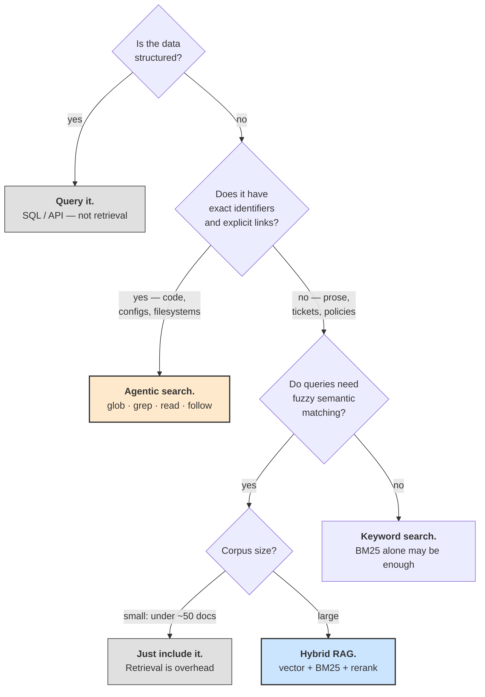

# **Module 3, Lesson 5: Agentic Retrieval and the Limits of Vector RAG**

### Building on What We've Learned

You've built the full RAG pipeline: ingest, chunk, contextualize, embed, retrieve, generate. It's a genuinely powerful architecture and you should know it well.

This lesson is about its edges — because between 2025 and 2026 a large part of the industry discovered that for an important class of problems, a much simpler approach wins. Understanding *why* will make you better at choosing, which is the actual skill.

### Learning Objectives

By the end of this lesson, you will be able to:
*   **Describe** agentic retrieval and contrast it with the vector RAG pipeline.
*   **Explain** why agentic search outperforms vector RAG on code and filesystems.
*   **Choose** a retrieval strategy from the properties of your corpus and queries.
*   **Design** a hybrid system that uses both.

---

### **1. The Reversal**

Through 2024, "put a vector index on your codebase" was standard advice for AI coding tools. By 2026 the major coding agents had **removed** their vector indexes.

What replaced them is unglamorous: the agent uses the tools a competent engineer would use.

```
User: "Why does checkout fail for EU customers?"

  glob   "**/checkout*"                        → 4 files
  grep   "EU|region|vat"  src/checkout/        → 3 hits, 2 look relevant
  read   src/checkout/tax.py:40-90             → sees the VAT branch
  grep   "calculate_vat"  --type py            → finds 2 callers
  read   src/checkout/order.py:120-140         → sees the caller's assumption
  bash   pytest tests/test_checkout.py -k eu   → reproduces the failure
```

Comparative research found grep-based agentic search **generally more accurate than vector retrieval** across multiple agent harnesses — with the important caveat that the harness and tool-calling style mattered more than the retrieval algorithm itself (Module 8, Lesson 1).

**This did not generalize into "RAG is dead."** It generalized into something more useful: *vector similarity is one signal, and for some corpora it's the wrong one.*

---

### **2. Why Agentic Search Wins on Code**

Five reasons, and each one tells you something about when the reversal *doesn't* apply.

**A. Code has exact identifiers.**
When you need `calculateVAT`, you need `calculateVAT` — not "functions semantically similar to tax calculation." Vector search actively works against you here: it blurs the exact token you care about into a neighbourhood of related concepts.

**B. Code is a graph, and the graph is traversable.**
Imports, calls, and definitions are explicit links. An agent can follow `order.py` → `tax.py` → `rates.py` deterministically. Vector search has no notion of "and now the thing this thing calls" — it can only find things that *read* similarly, which is not the same as things that are *connected*.

**C. Chunking mutilates code.**
A function split across two chunks is two useless fragments. Code has structure that character-based chunking is blind to, and the structure is exactly what carries the meaning.

**D. The index is always stale.**
A codebase changes many times a day. A vector index reflects the last time you ran the embedding job; `grep` reflects the state of the file right now. For a fast-changing corpus, freshness beats sophistication — and staleness in a code index doesn't degrade gracefully, it produces confidently wrong answers about code that no longer exists.

**E. Verification is free.**
The agent can run the tests. That closes the loop in a way no retrieval score can: relevance stops being estimated and becomes checked.

---

### **3. The Real Trade-off**

| | Vector RAG | Agentic search |
| :--- | :--- | :--- |
| **Latency** | One fast query | Many sequential tool calls |
| **Token cost** | Low, predictable | High, variable — the exploration is in context |
| **Infrastructure** | Index, embeddings, sync pipeline | Almost none |
| **Freshness** | As of last index run | Always current |
| **Exact identifiers** | Poor | Excellent |
| **Fuzzy semantics** | Excellent | Poor — you must guess the right keyword |
| **Following relationships** | No | Yes |
| **Failure mode** | Silently retrieves the wrong chunk | Runs out of budget having found nothing |

The honest summary: **agentic search trades tokens and latency for accuracy and freshness.** It's more expensive per query and needs no infrastructure. Vector RAG is cheap and fast per query and needs a pipeline you must build, run, and keep in sync.

Note the last row especially. The failure modes are *different in kind*, and that difference should drive your choice as much as the accuracy numbers. Vector RAG fails **silently and plausibly** — it returns something, and the model answers from it. Agentic search fails **loudly** — the agent reports it couldn't find it. In domains where a confident wrong answer is worse than no answer, that asymmetry matters more than any benchmark.

---

### **4. Choosing: A Decision Guide**

Ask about your corpus and your queries.



**Vector RAG remains the right answer for:** support tickets, policy documents, research literature, product documentation, chat transcripts, knowledge bases — large corpora of prose, queried in natural language, where the user's words won't match the document's words and the connections between documents are implicit.

**Agentic search is the right answer for:** codebases, configuration, filesystems, log files, structured document trees — anywhere identifiers are exact and relationships are explicit.

---

### **5. Combining Them**

The strongest systems use both, and route by query shape.

```python
def retrieve(query, corpus):
    # 1. Cheap, deterministic first pass: does the query contain an exact handle?
    if identifiers := extract_identifiers(query):        # SKU-123, ERR_X, func_name
        hits = keyword_search(identifiers, corpus)
        if hits:
            return hits                                  # done — no embedding needed

    # 2. Semantic pass for fuzzy questions.
    candidates = hybrid_search(query, corpus, k=50)
    ranked = rerank(query, candidates)[:5]

    # 3. Escalate to exploration only if the cheap paths came up empty or weak.
    if confidence(ranked) < THRESHOLD:
        return agentic_explore(query, corpus, budget=20_000)

    return ranked
```

Two design points worth stealing from this:

*   **Order by cost.** Try the cheap deterministic path first, then the cheap semantic path, and only spend an agentic exploration budget when both are weak. Most queries never reach step 3.
*   **Give retrieval an escape hatch.** `confidence(ranked) < THRESHOLD` is the retrieval-layer equivalent of the "I don't know" escape hatch you built into the generator in Lesson 4. A retrieval system that always returns its top five results, however bad, hands the generator garbage and asks it to be wise about it.

**The agentic-retrieval mindset, portable to any corpus:** stop thinking of retrieval as a *lookup* and start thinking of it as a *search process the agent conducts* — form a hypothesis, query, read, refine, query again. Vector search is one tool that process can use. Keyword search, metadata filters, and following explicit links are others. The agent decides.

---

### **Key Takeaways**

*   **Agentic search** — glob, grep, read, follow links, run the code — displaced vector RAG for code, and the harness mattered more than the algorithm.
*   It wins on code because of **exact identifiers, an explicit graph, chunking damage, index staleness, and free verification.** Where those don't hold, neither does the result.
*   The trade is **tokens and latency for accuracy and freshness** — and the failure modes differ in kind: vector RAG fails *silently*, agentic search fails *loudly*.
*   **Vector RAG remains correct** for large prose corpora with fuzzy queries and implicit relationships.
*   Combine them: **route by query shape, order by cost, and give retrieval an escape hatch** when confidence is low.

### **Hands-On Task: Choose and Combine**

**Part A — Route each system.** Choose vector RAG, agentic search, direct query, both, or none. Justify in two sentences, naming the corpus property that decided it.

1.  A support assistant over 80,000 historical Zendesk tickets.
2.  An agent that answers questions about your company's 2-million-line monorepo.
3.  A tool answering "which customers churned last quarter and what was their MRR?" over a data warehouse.
4.  An assistant over your team's 30-page engineering handbook.
5.  An agent that debugs production incidents using logs, traces, and the deploy history.
6.  A legal assistant over 15 years of contracts, where users ask things like "do any of our vendor agreements have unusual liability caps?"

**Part B — Design the router.** For system 5, write the routing logic. Which retrieval strategy handles which part, in what order, and what's the escalation condition between them?

**Part C — Cost the reversal.** Your team runs vector RAG over the monorepo: ~$400/month of infrastructure and a nightly re-index. A colleague proposes replacing it with agentic search — no infrastructure, but roughly 25,000 extra tokens per query at $5/1M input, over about 2,000 queries/month.

1.  Compute both monthly costs.
2.  Agentic search is more expensive here. Give the strongest argument for switching anyway — and be specific about which failure it eliminates.
3.  Name the one measurement you'd take *before* deciding, and say what result would change your recommendation.
