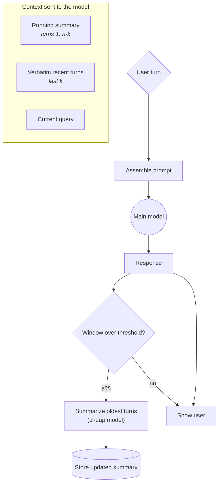

# **Module 4, Lesson 1: Mastering the Context Window**

### Building on What We've Learned

We can now fill a context window with relevant information. This module is about the harder discipline: deciding what *not* to put in it, and where to put what remains.

The premise of this entire module rests on one empirical finding, so we'll start by being precise about it.

### Learning Objectives

By the end of this lesson, you will be able to:
*   **Explain** context rot and the attention-budget model, and cite what the research actually shows.
*   **Distinguish** a model's nominal context window from its effective one.
*   **Structure** a prompt to place critical information in high-attention positions.
*   **Compare** strategies for managing long conversations.

---

### **1. Context Rot: The Finding That Drives Everything**

The intuitive model of a context window is a container: information is either in it or not, and anything inside is equally available. That model is wrong, and expensively so.

**What the research shows.** The most-cited systematic study tested **18 frontier models** on how performance changes as input length grows. The findings replicated across every model tested:

*   **Performance degrades continuously**, not at a cliff. There is no threshold below which you're safe.
*   **Degradation starts long before the limit.** A model with a 200K window can show serious accuracy loss at 50K tokens of input.
*   **Position matters.** Recall is strongest at the beginning and end of the context; accuracy in the middle can drop by 30% or more.
*   **Distractors compound it.** Adding plausible-but-irrelevant material hurts more than adding an equivalent volume of obviously irrelevant material.

The practical consequence is a number worth carrying around: **a model's effective context is commonly 60–70% of its nominal window.** A "1M token model" is not a model you can reliably put 1M tokens into.

**Why it happens.** Two mechanisms, both structural:

1.  **Attention is a budget.** Transformer attention computes relationships across all token pairs. As the sequence grows, that budget spreads thinner — every token gets a smaller share of the model's capacity to relate it to everything else.
2.  **Training distribution.** Models see far more short sequences than long ones during training, so they have less experience — and fewer specialized parameters — for genuinely long-range dependencies.

> **The reframe that matters:** stop thinking of the context window as **storage** and start thinking of it as **attention you are spending.** Every token you add is a small tax on every other token's salience. This is why "just put it all in the window" is not a strategy, and why the 1M-token era made this module more important rather than less.

---

### **2. Structure for Attention**

Since position affects recall, position is a design decision.

**The basic sandwich:**

1.  **Top — critical instructions.** System prompt, persona, hard rules. High primacy attention, and (as Module 1, Lesson 2 covered) the stable prefix your cache depends on.
2.  **Middle — the bulk.** Retrieved documents, long history, tool results. This is the low-attention zone; put here what the model needs to *have available*, not what it must not miss.
3.  **Bottom — the immediate task.** The user's question, the current step, the output format. High recency attention.

**Three refinements worth applying:**

*   **Restate critical constraints at the bottom.** If a rule absolutely must hold — "cite every claim," "never exceed the budget" — repeating it in one line just before the query costs a handful of tokens and materially improves adherence. The duplication is not sloppiness; it's placing the same instruction in both high-attention zones.

*   **Order retrieved documents by relevance, outward from the edges.** Given five ranked documents, don't emit them 1-2-3-4-5. Emit them so the strongest sit at the boundaries of the block:
    ```
    doc_1 (best)  doc_3  doc_5 (worst)  doc_4  doc_2 (2nd best)
    ```
    This "edge-loading" costs nothing and puts your best evidence where the model reads most reliably.

*   **Label everything.** `<retrieved_documents>`, `<conversation_summary>`, `<current_task>`. Labels help the model tell one kind of content from another — and they give *you* something to grep for when you're debugging a trace.

---

### **3. Managing Long Conversations**

In a chatbot, the window fills with dialogue. In an agent, it fills with tool results, which is worse — tool output is often verbose and mostly irrelevant after the turn that consumed it.

**A. Sliding window.**
Keep the last *K* turns.
*   **Pro:** trivial to implement, perfectly predictable cost.
*   **Con:** the bot abruptly forgets anything older, including the user's name, their goal, and the constraint they stated in turn 2.
*   **Use when:** only recent context matters — live commentary, quick transactional exchanges.

**B. Summarization memory.**
Periodically summarize older turns with a cheap model, and carry the summary forward.
*   **Pro:** retains key facts from far back at a fraction of the tokens.
*   **Con:** a bad summary means the bot misremembers — worse than forgetting, because it's confident. Adds latency and cost.
*   **Use when:** the conversation is long and its early content stays relevant.



**C. Hybrid — what production systems actually do.**
Keep the **last few turns verbatim** (recent detail matters and paraphrase loses it) plus a **running summary** of everything older. You get precision where precision matters and compression where it doesn't.

**D. Compaction and external memory.**
The agent-scale versions of the above, covered in Lesson 4 of this module. Preview: summarization applied to a *whole agent trajectory* — plans, tool calls, findings — with the important state deliberately written outside the context window so it can't be summarized away.

---

### **4. The Token Budget**

Make the budget explicit. A system without one drifts toward "include everything that seemed useful," which is how context rot arrives without anyone deciding it should.

```python
BUDGET = {
    "system_and_tools":  4_000,     # stable, cached
    "memory":            2_000,     # durable facts
    "retrieved_docs":   12_000,     # ← the flexible one
    "history":          10_000,     # summary + recent verbatim
    "current_task":      2_000,
    "response_headroom": 4_000,
}                                    # 34,000 total — well inside effective context
```

Two rules make a budget real rather than decorative:

*   **Enforce it in code, not by convention.** Assemble the context through a function that truncates or re-ranks to fit. A budget you don't enforce is a comment.
*   **When over budget, drop the *least valuable*, not the *most recent*.** The naive implementation truncates the oldest content, which is often the user's original goal. Rank by value and drop from the bottom of that ranking.

> **Pro-Tip: Measure your real utilization**
> Log the token count of every context you assemble, broken down by section. Most teams discover something surprising within a week — a tool returning 8,000 tokens of JSON where 40 would do, a document included on every turn that was needed on one. You cannot budget what you don't measure.

---

### **Key Takeaways**

*   **Context rot is measured, not folklore:** across 18 frontier models, accuracy falls continuously as input grows, starting well before the limit, with mid-context recall dropping 30%+.
*   **Effective context is roughly 60–70% of nominal.** Plan against the effective number.
*   The window is **attention you're spending**, not storage you're filling.
*   Put critical instructions at the top, bulk in the middle, the task at the bottom — **restate critical constraints at the bottom**, and **edge-load** ranked documents.
*   For long conversations, the production answer is **hybrid**: recent turns verbatim plus a running summary.
*   Set an explicit **token budget, enforced in code**, and drop by *value* rather than by age.

### **Hands-On Task: Diagnose and Budget**

**Part A — Choose a memory strategy.** For each, pick sliding window, summarization, or hybrid, and justify it.

1.  **Sarcastic Buddy Bot.** Makes witty remarks about the ongoing conversation. Needs the last thing said; doesn't need the user's name.
2.  **Project Manager Bot.** Helps plan a complex project over a long session. Must remember the project name, deadlines discussed 30 minutes ago, stakeholders, and budget.
3.  **Live Sports Ticker.** "What was that last play?" Only the last few minutes matter.
4.  **Therapy Intake Assistant.** A 45-minute structured intake. Early disclosures matter enormously; exact phrasing of recent statements also matters.

**Part B — Fix a context.** An agent assembles this on every turn, and quality degrades badly after about turn 15:

```
[  1,200]  System prompt
[    600]  Tool definitions
[ 18,000]  Full text of 6 retrieved documents (unranked, in retrieval order)
[ 24,000]  Complete conversation history, verbatim
[  9,000]  All tool results from every previous turn, verbatim
[     80]  Current user question
```

1.  **Total it up.** If this model's nominal window is 128K, is it "safe"? Answer using the *effective* window, and explain the difference.
2.  **Identify the three biggest problems**, in order of severity.
3.  **Rewrite the layout.** Produce a budgeted assembly under 40K, saying what happens to each section — kept, ranked, summarized, offloaded, or dropped — and why.
4.  **Explain the turn-15 cliff.** Why does quality collapse around there specifically, rather than degrading smoothly from turn 1? What would you log to confirm your explanation?
