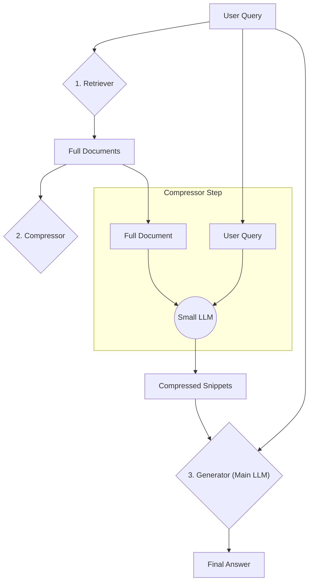

# **Module 4, Lesson 2: Contextual Compression and Distillation**

### Building on What We've Learned

In the last lesson, we learned strategies for managing the *size* of the context window. Now, we'll focus on improving the *quality* of the information we put inside it. The goal is to maximize **information density**—the amount of relevant "signal" per token.

### Learning Objectives

By the end of this lesson, you will be able to:
*   **Define** Contextual Compression and explain why it's used.
*   **Describe** two methods for compression: filtering and distillation/extraction.
*   **Diagram** a RAG pipeline that includes a compression step.
*   **Analyze** the trade-off between compression ratio and information fidelity.

---

### **1. The Problem: "Noisy" Documents**

Raw retrieved documents often contain a lot of "noise"—irrelevant sentences, boilerplate text, or redundant information that isn't helpful for answering the user's specific query.

**Example:**
*   **User Query:** "What is the battery life of the Pro model?"
*   **Retrieved Chunk:** `...The Standard model has an 8-hour battery. The Pro model features a 12-hour battery life and comes in three exciting colors: blue, black, and silver. All models ship with a USB-C cable...`

Only one sentence in that chunk is actually relevant. The rest is noise that increases token cost and can potentially confuse the LLM.

**Contextual Compression** is the process of filtering out this noise *before* the context gets to the main, expensive Generator LLM.

---

### **2. Compression as a Two-Step Process**

The most common way to implement this is to add a "compression" step to your RAG pipeline, right after retrieval.

**Diagram: RAG Pipeline with Compression**

We can implement this compression step in two main ways:

**Method 1: Filtering**
Use a small, fast LLM as a simple relevance gate. For each retrieved document, you ask it: **"Does this document contain information that directly answers this query? Answer only YES or NO."** You then pass only the "YES" documents to the Generator.

**Method 2: Distillation / Extraction**
This is more powerful. Instead of just filtering, we use the small LLM to **distill** the document down to its essential parts.
*   **Prompt to Compressor LLM:** `"Read the following DOCUMENT and extract only the specific sentences that are directly relevant to the USER's QUESTION. If no sentences are relevant, output nothing."`
*   **Result:** The context passed to the Generator is a new, clean collection of just the most relevant sentences from the original documents.

This distillation process ensures that the context given to the expensive Generator LLM is extremely clean and dense, leading to better, faster, and cheaper responses.

---

### **3. The Trade-Off: Compression vs. Fidelity**

Contextual compression is a balancing act.

*   **High Compression (Aggressive):** You could extract only a few keywords or very short phrases.
    *   **Pro:** Saves the most tokens (lowest cost).
    *   **Con:** You risk losing important nuance or context, which could cause the final answer to be incorrect. This is called losing **fidelity**.
*   **Low Compression (Conservative):** You could extract full paragraphs that contain relevant information.
    *   **Pro:** Preserves more fidelity and context.
    *   **Con:** Saves fewer tokens.

The right balance depends entirely on your use case. Factual Q&A can tolerate high compression, while complex reasoning requires more fidelity.

> **Pro-Tip: Use Pre-built Retrievers**
> Most retrieval frameworks ship a contextual-compression retriever that wraps the retrieve-then-compress workflow, letting you swap compressor models without rewriting the boilerplate.

---

### **4. Where Else Compression Applies**

The pattern here — *use a cheap model to reduce something before it reaches the expensive one* — is not limited to retrieved documents. Three other places it pays, all of which you'll meet in the next lesson and in Module 5:

*   **Tool results.** A tool returning 8,000 tokens of JSON is a compression opportunity dressed as a data structure. Summarize it, offload the bulk to a file, and put a reference in context (Module 5, Lesson 2).
*   **Conversation history.** Summarization memory *is* compression applied to dialogue. At agent scale it becomes **compaction** (Lesson 4).
*   **Sub-agent output.** A sub-agent that explores in 50,000 tokens and returns 1,500 is performing the most aggressive compression in this course — and the cheapest, because the coordinator never pays for the discarded 48,500 (Lesson 4).

Compression, compaction, distillation, and sub-agent isolation are four names for one idea applied to four kinds of content. If you understand the fidelity trade-off here, you understand all four.

---

### **Key Takeaways**

*   **Contextual Compression** is a technique to filter out "noise" from retrieved documents before they reach the main LLM.
*   It works by using a smaller, faster LLM to either **filter** entire documents or **distill** them by extracting only the most relevant sentences.
*   There is a direct trade-off between **compression ratio** and **information fidelity**. Factual Q&A tolerates aggressive compression; complex reasoning does not.
*   The same pattern applies to **tool results, conversation history, and sub-agent output** — compression, compaction, and isolation are one idea applied to different content.

### **Hands-On Task: To Compress or Not to Compress?**

For each scenario, decide if contextual compression would be highly beneficial, potentially useful, or likely unnecessary. Explain your reasoning.

1.  **Scenario A: Legal Document Analysis**
    *   A lawyer asks, "What are the termination clauses in this 50-page contract?" The RAG system retrieves the 5 most relevant pages.

2.  **Scenario B: Simple Product FAQ**
    *   A user asks, "What's the return policy?" The retriever finds a single, short document chunk that says: "You can return any item within 30 days for a full refund."

3.  **Scenario C: Scientific Research Summarization**
    *   A scientist asks, "What are the latest findings on protein folding?" The retriever returns 5 different research paper abstracts, each about 300 words long. 
