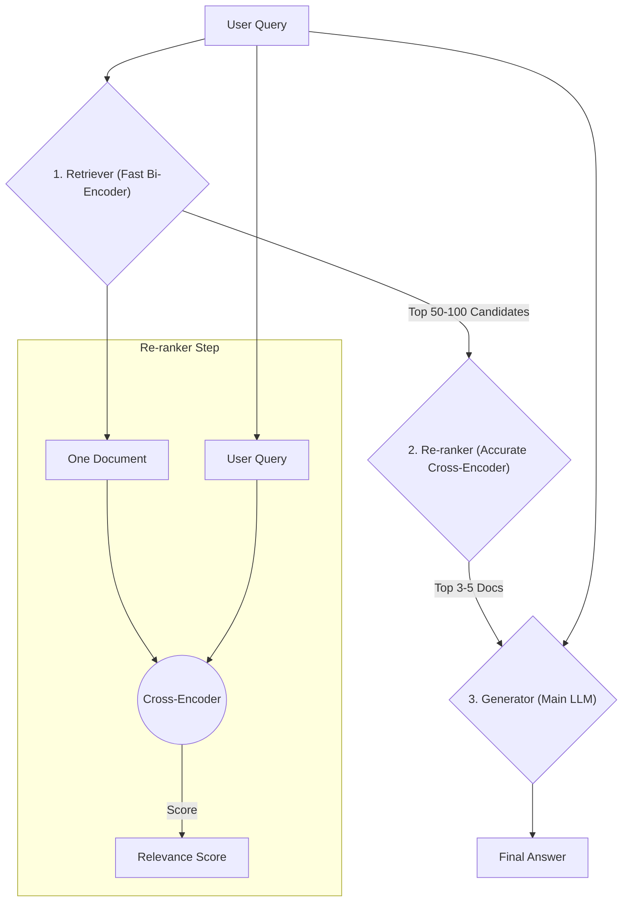

# **Module 4, Lesson 3: Re-ranking for Relevance**

### Building on What We've Learned

We've learned how to retrieve documents and compress them. Re-ranking is a final, powerful optimization step we can take to ensure the documents we feed to our Generator are the absolute best, most relevant ones available.

### Learning Objectives

By the end of this lesson, you will be able to:
*   **Explain** the purpose of a re-ranker in a RAG pipeline.
*   **Differentiate** between a bi-encoder (for retrieval) and a cross-encoder (for re-ranking).
*   **Diagram** a RAG pipeline that includes a re-ranking step.
*   **Apply** metadata filtering to a retrieved set of documents.
*   **Identify** the techniques that improve retrieval *before* re-ranking, and know where to spend effort first.

---

### **1. The Problem: "Good Enough" vs. "The Best"**

The retrieval models we use in our vector databases are called **bi-encoders**. They are designed for one thing: **speed**. They create vector embeddings for the query and documents *independently* and then just compare the vectors. This is fast enough to search millions of documents, but it's not always perfectly accurate. It's a "good enough" first pass.

A **cross-encoder** is a different type of model designed for **accuracy**.
*   **How it Works:** It takes both the user's query and a single document *together* as one combined input. It can then perform a much deeper, token-by-token analysis of the relationship between them.
*   **The Catch:** This deep analysis is much, much slower. You could never use a cross-encoder to search your whole database.

This is why we use a multi-stage process: use the fast bi-encoder to find the "haystack" and the slow, accurate cross-encoder to find the "needle."

**Diagram: The Re-ranking Pipeline**

**The Workflow:**
1.  **Retrieve (Fast & Broad):** Use your vector database to retrieve a large set of candidate documents (e.g., the top 50).
2.  **Re-rank (Slow & Accurate):** For each of those 50 documents, use a cross-encoder to get a highly precise relevance score.
3.  **Select:** Take the top K (e.g., top 3-5) documents from the re-ranked list. These are now the highest quality, most relevant documents to pass to your Generator LLM.

This hybrid approach gives you the best of both worlds: the speed of vector search and the accuracy of a cross-encoder.

---

### **2. Filtering by Metadata**

Sometimes, relevance isn't just about the *content* of a document, but its *metadata*—like its creation date, source, or author. Most vector databases allow you to store this metadata alongside your vectors. You can then use this metadata to filter your results after the retrieval step.

**Example Use Case:**
*   **User Asks:** "What were our Q1 earnings?"
*   **Retriever Finds:** Documents about Q1 earnings from 2024, 2023, and 2022.
*   **You Assume:** The user probably wants the most recent information.
*   **Filter Step:** Before re-ranking, you can programmatically filter out any documents where `year != 2024`.

This is a powerful way to add business logic to your RAG pipeline, making the final output even more reliable and tailored to the user's implicit needs.

---

### **3. Improving Retrieval Before It Happens**

Re-ranking and filtering fix the *ordering* of what you already retrieved. They can't recover a document the retriever never surfaced. Three techniques attack the problem earlier in the pipeline, and they compose with re-ranking rather than replacing it.

**A. Contextual retrieval (index time).**
Covered in Module 3, Lesson 2: prepend a generated sentence situating each chunk in its source document before embedding. This fixes the orphaned-chunk failure — where the words that would have matched the query lived in the document title rather than the chunk. It is the highest-leverage of the three because it costs nothing per query.

**B. Query transformation (query time).**
The user's phrasing is often a poor search query. Two cheap transformations help a lot:

*   **Query expansion / multi-query.** Generate 3–4 paraphrases of the question, retrieve for each, and fuse the results. Different phrasings surface different documents, and the union has substantially better recall than any single phrasing.
*   **Hypothetical document embedding (HyDE).** Have a cheap model write a *hypothetical answer* to the question, then embed **that** and search with it. This works because of an asymmetry people often miss: a question and its answer are frequently *not* semantically close (`"why is my build slow?"` vs. `"incremental compilation is disabled when..."`), but a hypothetical answer and the real answer usually are.

**C. Better retrievers (model level).**
The embedding models themselves improved. Two developments worth knowing by name:

*   **Late-interaction retrievers** (the ColBERT family) embed *per token* rather than per document, and score by matching tokens between query and document. They land between bi-encoders and cross-encoders on both accuracy and cost — more accurate than a single-vector bi-encoder, far cheaper than a full cross-encoder — at the price of a larger index.
*   **Instruction-tuned embedding models** accept a task description alongside the text (`"Represent this passage for retrieval by support engineers debugging errors"`), producing embeddings tuned to your retrieval task rather than to generic similarity.

> **Where to spend your effort, in order:** hybrid search → contextual retrieval → re-ranking → query transformation → a better embedding model. The first three are cheap, well-understood, and compose cleanly. Swapping embedding models means re-indexing your entire corpus, which is why it belongs last despite being the most tempting-sounding.

---

### **Key Takeaways**

*   **Re-ranking** uses a slow, accurate **cross-encoder** to re-order the fast retriever's candidates. The standard pipeline is **retrieve broadly → re-rank accurately → generate**.
*   Re-ranking is one of the highest return-per-effort changes available: it commonly buys a large accuracy gain for a modest latency cost, with **no re-indexing**.
*   **Metadata filtering** applies business logic (recency, source, permissions) that relevance scores cannot express.
*   Re-ranking cannot recover what was never retrieved. **Contextual retrieval, query transformation (multi-query, HyDE), and better retrievers** attack the problem earlier.
*   Spend effort in this order: **hybrid search → contextual retrieval → re-ranking → query transformation → new embedding model.**

### **Hands-On Task: Design the Final Pipeline**

**Scenario:**
You are building the "ultimate" RAG pipeline for a financial services company. It needs to be as accurate as possible and handle complex user queries.

**Your Task:**
Draw a diagram (using Mermaid if you can, or just text) that shows the complete flow of a user query through the following components. Connect them with arrows to show the sequence.

**Components to include:**
1.  User query
2.  Query transformation (multi-query or HyDE)
3.  Hybrid retriever (vector + BM25, fused)
4.  Metadata filter (last 12 months only; documents the user is cleared to see)
5.  Re-ranker (cross-encoder)
6.  Contextual compressor
7.  Generator
8.  Final answer with citations

**Then answer these:**

1.  **Where does the funnel narrow?** Give a candidate count at each stage (e.g. 4 queries → 200 candidates → …) and justify each number.
2.  **Where does the permission filter go, and why can it not go anywhere else?** Be specific about what breaks if it sits one stage later.
3.  **Two stages could be dropped to halve latency.** Which two, what accuracy do you expect to lose, and how would you decide whether the trade is acceptable?
4.  **Which stage would you add first if this were a v1 with only steps 1, 3, 7, and 8?** Justify it using the priority order from section 3. 