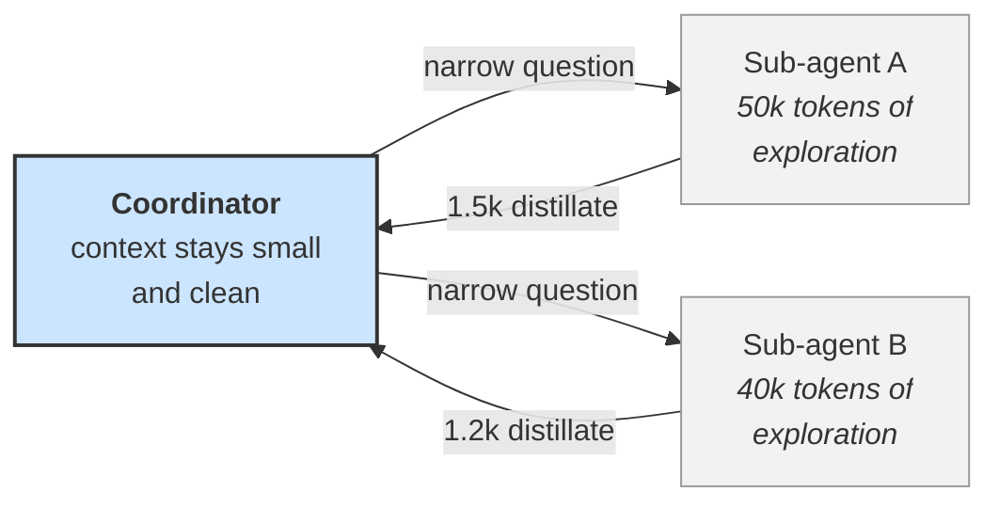

# **Module 4, Lesson 4: Context Engineering for Long-Horizon Agents**

### Building on What We've Learned

Everything so far assumed a bounded interaction: a query, a retrieval, an answer. Agents break that assumption. A single agent task can run for hours across hundreds of turns, generating far more tokens than any window can hold — and Lesson 1 told us the window degrades long before it fills.

This lesson covers the four techniques that make long-horizon agents work. They are the difference between an agent that stays coherent over a two-hour task and one that starts confidently improvising at minute forty.

### Learning Objectives

By the end of this lesson, you will be able to:
*   **Implement** compaction and choose what to preserve verbatim through it.
*   **Design** structured note-taking so critical state lives outside the context window.
*   **Use** sub-agent context isolation to compress expensive exploration.
*   **Apply** just-in-time retrieval so context is loaded on demand rather than pre-loaded.

---

### **1. The Problem, Concretely**

```
Turn   1:   4,200 tokens   [system + tools + task]
Turn  10:  31,000 tokens   [+ 9 tool results, some large]
Turn  30:  98,000 tokens   [+ file contents, search results, errors]
Turn  60: 210,000 tokens   [approaching the limit; quality has been degraded for a while]
Turn  85:      ✗           [context exhausted mid-task]
```

Two things are going wrong, and only one of them is obvious:

*   **The visible failure:** the agent runs out of window and the task dies at turn 85.
*   **The invisible failure:** quality started degrading around turn 30, when the *effective* context filled. By turn 60 the agent has been making worse decisions for half an hour, and nothing in your logs says so.

The second is the expensive one. An agent that crashes gets retried. An agent that quietly gets worse ships bad work.

**The four techniques, at a glance:**

| Technique | What it does | Best for |
| :--- | :--- | :--- |
| **Compaction** | Summarize the trajectory, restart with the summary | Long conversational or exploratory runs |
| **Structured note-taking** | Write state to durable files outside the window | Anything where losing state is unacceptable |
| **Sub-agent isolation** | Delegate token-heavy work; receive only the distillate | Research, search, broad exploration |
| **Just-in-time retrieval** | Carry identifiers, load content on demand | Large corpora and filesystems |

---

### **2. Compaction**

**Compaction** takes a conversation approaching the window limit, summarizes it, and reinitializes a fresh context with that summary plus the essentials.

```python
def maybe_compact(messages, threshold=0.7, window=200_000):
    if count_tokens(messages) < threshold * window:
        return messages

    # Keep the anchors: the original task, and recent turns verbatim.
    system, task = messages[0], messages[1]
    recent = messages[-6:]
    middle = messages[2:-6]

    summary = cheap_model(COMPACT_PROMPT, trajectory=middle)
    return [system, task, {"role": "user", "content": f"<prior_work>{summary}</prior_work>"}, *recent]
```

**Compact at ~70% of the window, not at 95%.** By 95% you've already spent half the run in degraded territory. The threshold should be set from the *effective* window, not the nominal one.

**What the compaction prompt must preserve.** This is where compaction succeeds or fails, and the instinct to write "summarize the conversation" is what makes it fail:

```
Summarize the agent's work so far, preserving ALL of the following. Omitting any
of these will cause the agent to repeat work or lose the thread.

1. The original goal, verbatim.
2. Decisions made and the reason for each.
3. Findings — facts discovered, with where they came from.
4. Dead ends — what was tried and failed, and WHY. (Without this the agent
   will retry them.)
5. Open questions and remaining work.
6. Exact identifiers encountered: file paths, IDs, URLs, error strings,
   version numbers. Reproduce these EXACTLY; do not paraphrase.

Omit: verbose tool output, superseded intermediate reasoning, pleasantries.
```

Item 4 is the one people forget and the one that costs most — a compaction that drops failed attempts produces an agent that cheerfully retries the same broken approach, discovers it fails, and compacts that away too. Item 6 is second: a paraphrased file path is a useless file path.

> **Tune it in the right order.** Start by preserving *too much* — maximize recall, verify the agent stays coherent across a compaction boundary — then trim toward precision. Tuning for brevity first produces a compaction that looks great and quietly amputates something critical.

**Low-risk compaction you should do first:** clear old tool results. If the agent read a file 40 turns ago and has since acted on it, the file's full contents no longer need to be in context — a one-line note that it was read, and what mattered in it, is enough. This is often the single largest win available and it requires no summarization at all.

---

### **3. Structured Note-Taking: Memory Outside the Window**

Compaction is lossy by construction. For state you cannot afford to lose, don't summarize it — **write it down somewhere the summarizer can't touch.**

The agent maintains files as it works:

```
workspace/
  goal.md          # the original objective, never rewritten
  plan.md          # steps, with status: todo / doing / done / blocked
  findings.md      # facts discovered, each with its source
  blockers.md      # what failed and why — read before retrying anything
```

On each turn the agent reads the small ones and writes updates. On compaction, these survive untouched, because they were never in the conversation to begin with.

**Why this is more than a trick.** It changes the failure mode. With context-only memory, losing the window means losing the work. With externalized state, the window becomes a *cache* over durable storage — and cache loss is an inconvenience, not a catastrophe. It also makes the agent's reasoning **inspectable**: you can open `plan.md` mid-run and see exactly what it thinks it's doing.

This is the mechanism behind the **reset loop** pattern (Module 8, Lesson 2), where every iteration starts from an empty context and reads state from disk. Context rot becomes structurally impossible because context never accumulates.

> **The test for what to externalize:** if losing this would make the agent redo work or repeat a mistake, it goes in a file. If it's merely convenient to remember, let compaction handle it.

---

### **4. Sub-Agent Context Isolation**

The compression ratio here is unmatched by anything else in this module:

> A sub-agent can spend **50,000 tokens** exploring and return **1,500 tokens** of distilled findings. The coordinator never sees the other 48,500.



**The design question is not "what roles should my agents have?"** It's:

> **"Which work generates a lot of tokens whose details the coordinator doesn't need?"**

Searching a large codebase. Reading twelve documents to answer one question. Trying six approaches to find the one that works. In each case the *process* is expensive and the *result* is small — which is exactly the shape sub-agent isolation is for.

Work that doesn't fit that shape should stay in the main agent. If the coordinator needs the details anyway, delegating just adds cost and a serialization boundary. Full treatment in Module 8, Lesson 3.

---

### **5. Just-in-Time Retrieval**

The RAG instinct is to fetch everything relevant up front. For agents, the better default is inverted: **carry lightweight identifiers, load content when needed.**

```python
# Pre-loading — the RAG habit.
context = load_all_files(glob("src/**/*.py"))       # 400k tokens. Immediately doomed.

# Just-in-time — the agent habit.
context = file_tree(depth=3)                        # 2k tokens of structure
# The agent then calls read_file(path) for the three files it turns out to need.
```

**Why this works better than it sounds.** The metadata itself is informative — a directory layout, a filename, a modification time, a heading structure. A human engineer navigates a codebase this way: not by reading everything, but by using structure to decide what's worth reading. The agent can do the same, and each read is *informed by* what the previous read revealed. Pre-loading has to guess relevance in advance, with none of that information.

**The trade-off is latency.** Exploration takes turns; pre-loading is one shot. The practical answer is usually **hybrid**: pre-load the small, high-certainty things (the project's conventions file, the current diff, the user's stated goal) and let the agent explore for the rest.

**Two supporting techniques:**

*   **Progressive disclosure of capability.** Agent Skills work this way (Module 5, Lesson 4): a skill's name and description cost ~40 tokens; the full procedure loads only when the task matches. This makes capability sub-linear in context cost.
*   **Offloading large results.** When a tool returns something enormous, write it to a file and put a *reference* in context: `"Query returned 4,200 rows; saved to /tmp/results.csv. Columns: id, region, amount."` The agent can then grep, sample, or aggregate the file rather than carrying it.

---

### **6. Putting It Together**

```python
def agent_turn(state):
    ctx = []
    ctx += [SYSTEM, TOOL_DEFS]                          # stable, cached
    ctx += [read("workspace/goal.md")]                  # never lost           §3
    ctx += [read("workspace/plan.md")]                  # current state        §3
    ctx += [read("workspace/blockers.md")]              # don't retry these    §3

    if state.summary:
        ctx += [state.summary]                          # post-compaction      §2
    ctx += state.recent_turns[-6:]                      # verbatim recency

    ctx += [state.current_step]                         # task last, high recency

    response = model(ctx)                               # tools include:
                                                        #   read_file (JIT)    §5
                                                        #   delegate (subagent)§4

    state = apply(response, state)
    write_notes(state)                                  # externalize          §3
    if tokens(ctx) > 0.7 * EFFECTIVE_WINDOW:
        state.summary = compact(state)                  # compact early        §2
    return state
```

**The unifying principle across all four techniques:**

> **Keep the working context small and current. Put everything else somewhere addressable.**

That's the whole discipline. Compaction addresses history, note-taking addresses state, sub-agents address exploration, and JIT retrieval addresses corpus — but they're four applications of one idea.

---

### **Key Takeaways**

*   Long-horizon agents fail **twice**: visibly when context is exhausted, and invisibly when quality degrades much earlier. The invisible failure is the expensive one.
*   **Compact at ~70% of the *effective* window.** Preserve the goal, decisions, findings, **dead ends**, and **exact identifiers**. Tune for recall first, precision second.
*   **Externalize state to files.** If losing it would cause repeated work or repeated mistakes, it doesn't belong only in the context window.
*   **Sub-agent isolation** gives a compression ratio nothing else matches — delegate work that's token-heavy and result-light.
*   **Just-in-time retrieval:** carry identifiers, load on demand. Metadata is itself informative, and each read informs the next.
*   One principle underneath all four: **keep the working context small and current; put everything else somewhere addressable.**

### **Hands-On Task: Engineer for the Long Haul**

**Scenario.** You're building a "Codebase Migration Agent" that migrates a 400-file project from one framework to another. A full run takes 3–5 hours and hundreds of turns.

**Part A — Design the context strategy.**

1.  **Compaction.** At what threshold? Write the compaction prompt, and name the two items whose omission would most damage this specific agent.
2.  **Note-taking.** Which files does the agent maintain? For each, say what's in it and when it's written. Which one prevents the most expensive failure?
3.  **Sub-agents.** Name one task in this migration that should be delegated and one that shouldn't. Justify both using the "token-heavy, result-light" test.
4.  **JIT retrieval.** What's pre-loaded on every turn versus loaded on demand? Justify the split.

**Part B — Debug a degradation.** The agent works well for the first ~80 files and then starts producing migrations that ignore project conventions it followed earlier.

1.  Give the most likely cause.
2.  Which technique fixes it, specifically?
3.  What would you log to confirm the diagnosis before changing anything?

**Part C — Survive a crash.** The process is killed at hour 4, file 300 of 400.

1.  What must have been externalized for a restart to resume rather than begin again?
2.  Write the first three actions the restarted agent takes.
3.  Name one thing that will be lost regardless, and argue whether that's acceptable.
