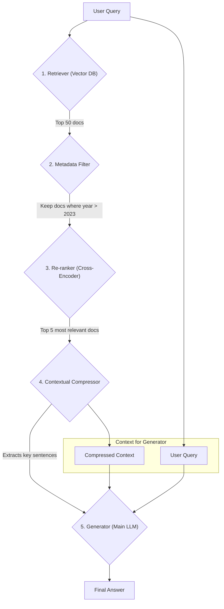

# **Module 4: Solutions to Hands-On Tasks**

This document provides the suggested solutions for the "Hands-On Tasks" in each lesson of Module 4.

---

### **[Lesson 1: Mastering the Context Window](./Lesson1_Mastering_the_Context_Window.md)**

#### **Task: Diagnose and Budget**

#### **Example Solution — Part A: memory strategies**

1.  **Sarcastic Buddy Bot → Sliding window.** Only the last turn or two feed a relevant joke; nothing older has value. Summarization would add latency and cost to preserve information the bot has no use for. Keep K small (2–4 turns).

2.  **Project Manager Bot → Hybrid.** Pure sliding window loses the budget figure stated forty minutes ago; pure summarization garbles the exact deadline discussed thirty seconds ago. Keep the last ~6 turns verbatim and a running summary of everything before — and note that the structured facts (project name, deadlines, stakeholders, budget) are better held as **externalized state** than as prose in a summary, which is the bridge to Lesson 4.

3.  **Live Sports Ticker → Sliding window**, sized in time rather than turns: keep the last 2–3 minutes of events. Anything older is not merely low-value, it's actively misleading — "who just scored?" answered with a first-half goal is wrong.

4.  **Therapy Intake Assistant → Hybrid, weighted toward preservation.** This is the case where getting it wrong is most costly. Early disclosures must survive the full 45 minutes, so summarization is mandatory — but a summary that paraphrases a disclosure loses clinically significant wording. The right design keeps recent turns verbatim, maintains a *structured* record of disclosures (quoted, not paraphrased, with timestamps) outside the summary, and treats the prose summary as covering only the conversational connective tissue.

#### **Example Solution — Part B: fixing a context**

**1. The total, against the *effective* window**

1,200 + 600 + 18,000 + 24,000 + 9,000 + 80 = **52,880 tokens**, plus response headroom.

Against a 128K nominal window that looks comfortable — about 41%. But the effective window is roughly 60–70% of nominal, so call it **~85K usable**. At 52,880 we're at **62% of effective capacity** on turn 15 — and every turn adds more. It is not safe; it is *already in the degradation zone*, which is exactly why quality is dropping.

The distinction matters: measuring against 128K tells you there's plenty of room and invites you to add more. Measuring against ~85K tells you you're two-thirds of the way to unusable.

**2. The three biggest problems, in order**

1.  **24,000 tokens of verbatim history, unmanaged.** The largest single block, growing every turn, and mostly superseded. Nothing here is filtered by value.
2.  **9,000 tokens of stale tool results.** Tool output from turn 3 that has already been acted on. This is pure waste — the highest-ratio removal available, and the easiest.
3.  **18,000 tokens of unranked documents in retrieval order.** Two failures at once: too much, and the best evidence is at an arbitrary position. Six full documents where three ranked, compressed excerpts would do.

*(The current question at 80 tokens is fine, and correctly placed last.)*

**3. A budgeted rewrite, under 40K**

| Section | Before | After | What happened |
| :--- | ---: | ---: | :--- |
| System prompt | 1,200 | 1,200 | Kept — stable, cached |
| Tool definitions | 600 | 600 | Kept — stable, cached |
| Retrieved documents | 18,000 | 6,000 | **Re-ranked** to top 3, **compressed** to relevant passages, **edge-loaded** (best first and last) |
| Conversation history | 24,000 | 8,000 | **Hybrid**: running summary of turns 1–9 (~3,000) + last 6 turns verbatim (~5,000) |
| Tool results | 9,000 | 2,000 | **Offloaded**: full outputs written to files; context keeps one-line references and the extracted findings |
| Current question | 80 | 80 | Kept, last |
| Restated constraints | — | 150 | **Added**: critical rules repeated just before the query |
| **Total** | **52,880** | **18,030** | ~66% reduction |

That leaves ample headroom for another 30 turns of growth before compaction triggers.

**4. The turn-15 cliff**

Quality doesn't actually collapse at turn 15 — it has been degrading since roughly turn 8. Turn 15 is where degradation crosses the threshold of being *noticeable to a human*.

The specific mechanism is the interaction between two growing quantities: history and tool results both accumulate linearly, so total context grows roughly linearly, but the *proportion* of the context that is currently-relevant falls. By turn 15 the signal-to-noise ratio has inverted — most of what the model is attending to is superseded material, and the current question is competing with 50,000 tokens of history for attention.

**To confirm before changing anything, log per turn:**
*   Total context tokens, **broken down by section** — this shows you which block is actually growing.
*   The ratio of *current-turn-relevant* tokens to total.
*   Position of the answer-bearing content within the assembled context.
*   A per-turn quality score from your eval harness, so you can plot degradation against tokens and see where the curves actually cross — rather than trusting the turn number where someone happened to notice.

---

### **[Lesson 2: Contextual Compression and Distillation](./Lesson2_Contextual_Compression_and_Distillation.md)**

#### **Task: To Compress or Not to Compress?**

*For each scenario, decide if contextual compression would be highly beneficial, potentially useful, or likely unnecessary.*

#### **Example Solution:**

1.  **Scenario A: Legal Document Analysis**
    *   **Verdict:** **Highly Beneficial**
    *   **Reasoning:** A 50-page contract contains a massive amount of boilerplate and irrelevant clauses. Retrieving the 5 most relevant *pages* is still far too much context. A compression step that distills those 5 pages down to only the specific sentences containing keywords like "terminate," "termination," "notice period," etc., would dramatically improve the signal-to-noise ratio, leading to a more accurate and cheaper final answer.

2.  **Scenario B: Simple Product FAQ**
    *   **Verdict:** **Likely Unnecessary**
    *   **Reasoning:** The retrieved chunk is already short, concise, and highly relevant. It represents high-information-density context. Running a compression step would add latency and cost for little to no benefit, and it would even risk accidentally filtering out the single important sentence.

3.  **Scenario C: Scientific Research Summarization**
    *   **Verdict:** **Potentially Useful**
    *   **Reasoning:** Research paper abstracts are dense, but may still contain noise relative to a very specific query (e.g., information about funding sources, author affiliations). A conservative compression step could help by extracting only the "Methods" and "Results" sections while filtering out the "Introduction." However, an overly aggressive compression could lose critical nuance, so the trade-off must be carefully managed.

---

### **[Lesson 3: Re-ranking for Relevance](./Lesson3_Re-ranking_for_Relevance.md)**

#### **Task: Design the Final Pipeline**

*Draw a diagram that shows the complete flow of a user query through all the major RAG components.*

#### **Example Solution:**


**Explanation of the Flow:**

1.  The **User Query** is sent to the **Retriever**, which does a fast vector search on the entire knowledge base, returning a large number of candidates (e.g., 50).
2.  These 50 candidates are passed to the **Metadata Filter**, which programmatically removes any document older than 12 months.
3.  The remaining documents are passed to the **Re-ranker**. This slow, accurate cross-encoder scores each document for relevance and sorts them, outputting the top 5.
4.  These 5 high-quality documents are then sent to the **Contextual Compressor**, which uses a smaller LLM to read them and extract only the most essential sentences.
5.  This highly-dense, compressed context is combined with the original **User Query** and sent to the main **Generator** LLM.

*(The updated task adds query transformation and hybrid retrieval at the front, and a permission filter. The pipeline becomes: query → transform → hybrid retrieve → filter → re-rank → compress → generate.)*

#### **1. Where the funnel narrows**

| Stage | Count | Why |
| :--- | :--- | :--- |
| User query | 1 | — |
| Query transformation | 4 queries | Original plus three paraphrases. Beyond four, added recall falls off while latency and cost keep rising |
| Hybrid retrieval | ~200 candidates | 4 queries × 25 from vector + 25 from BM25, deduplicated. Wide, because everything downstream can only *remove* |
| Metadata + permission filter | ~120 | Cheap and deterministic — do it before the expensive stage |
| Re-ranker | 8 | A cross-encoder over 120 is affordable; over 200 it's needlessly slower |
| Compressor | 8 passages, ~60% smaller | Extracts relevant sentences; count stays the same, volume drops |
| Generator | 5 passages | Final selection after compression reveals which are genuinely substantive |

**The shape to internalize:** wide at the top, aggressively narrowing, with the expensive stages operating on the smallest set that still contains the answer.

#### **2. Where the permission filter goes — and why nowhere else**

**It must run before the re-ranker, and its results must be enforced before anything reaches the generator.** Ideally, permission scoping is applied at *retrieval* time — as a filter in the query itself — rather than as a post-filter.

**What breaks if it sits one stage later** (after re-ranking, before compression): nothing user-visible, immediately. But the re-ranker has now scored documents the user isn't cleared to see, and those scores affect which permitted documents make the top 8. More seriously, the pattern invites the next mistake: any code path that skips the post-filter — a debug endpoint, a cache, a retry path, a new feature that reuses the retriever — leaks. **A filter applied late is a filter that will eventually be bypassed.** Permission belongs in the retrieval query, so unauthorized documents are never in the pipeline at all.

#### **3. Two stages to drop to halve latency**

Drop **query transformation** and **compression**.

*   *Query transformation* costs a model call plus 4× the retrieval work, and buys recall. With hybrid search plus a good re-ranker, most of that recall is already there — you lose the tail of hard-to-phrase queries.
*   *Compression* costs a model call over 8 passages, and buys token efficiency rather than accuracy. You pay more per generation, but quality barely moves.

**Keep re-ranking.** It is the largest accuracy contributor per unit of latency in the pipeline; dropping it would halve latency and cost you far more.

**How to decide:** measure both configurations on your eval set. Compare **context recall** (does the answer-bearing document survive?) and end-to-end faithfulness. If recall drops less than ~2 points and faithfulness is flat, the trade is good. In finance the acceptable degradation is near zero — which likely means the answer is to *parallelize* the transformation queries instead of removing them.

#### **4. What to add first to a v1**

**Re-ranking** — following the priority order from section 3, and because a v1 with only vector retrieval is almost certainly bottlenecked on precision, not recall. It requires no re-indexing, is a single API call, and typically produces the largest single accuracy jump available.

*Caveat worth stating:* if the v1's retrieval is failing because documents are *never surfaced* (poor recall), re-ranking cannot help — it only reorders what it's given. Check context recall first. If recall is the problem, hybrid search comes before re-ranking.


6.  The Generator synthesizes the final, accurate answer. 
---

### **[Lesson 4: Context Engineering for Long-Horizon Agents](./Lesson4_Long_Horizon_Context.md)**

#### **Task: Engineer for the Long Haul**

#### **Example Solution — Part A: the context strategy**

**1. Compaction**

**Threshold: 65% of the effective window** — slightly more aggressive than the 70% default, because a migration run is long and uniform, so compaction boundaries are frequent and each one should leave generous headroom.

```
Summarize this migration session, preserving ALL of the following:

1. The migration goal and the target framework version, verbatim.
2. CONVENTIONS ESTABLISHED: every pattern decision made so far — naming,
   import style, test structure, error handling, how fixtures are declared.
   Quote a canonical example of each. These govern every remaining file.
3. Files completed, with their status (migrated / migrated-with-caveats).
4. FAILED APPROACHES: what was tried on which file, why it failed, and what
   was done instead.
5. Known blockers and the files they affect.
6. Exact identifiers: file paths, module names, API signatures, version
   numbers. Reproduce EXACTLY.

Omit: full file contents, successful diffs already applied, tool chatter.
```

**The two items whose omission would most damage this agent:**

*   **Conventions established (item 2).** This is the one specific to migration work. The agent makes dozens of small style decisions in the first twenty files — how it names the migrated test fixtures, how it orders imports, how it handles the framework's async idiom. If compaction drops these, file 81 is migrated in a different style from file 80, and you get a codebase that is internally inconsistent in a way no single diff review catches.
*   **Failed approaches (item 4).** Without it the agent re-attempts a transformation that already failed on three files, wasting an hour and possibly leaving broken intermediate state.

**2. Note-taking**

| File | Contents | Written when |
| :--- | :--- | :--- |
| `goal.md` | The migration objective, source and target versions, scope. Written once, never modified | At start |
| `conventions.md` | Every pattern decision, with a canonical code example | Whenever a new pattern decision is made |
| `progress.md` | All 400 files with status: `todo` / `doing` / `done` / `blocked` | After every file |
| `blockers.md` | Files that failed, the error, and what was tried | On any failure |

**`conventions.md` prevents the most expensive failure.** Progress can be reconstructed by inspecting the repository — you can see which files were migrated. Conventions cannot be reconstructed; they exist only as decisions the agent made, and losing them produces silent, pervasive inconsistency that surfaces weeks later during code review. It's also the file that makes the migration reviewable by a human, since it documents *why* the code looks the way it does.

**3. Sub-agents**

*   **Delegate: "find every usage of the old framework's API across the repo and categorize it by which migration pattern applies."** Token-heavy (greps across 400 files, reading many of them), result-light (a categorized list of maybe 60 lines). Textbook fit.
*   **Don't delegate: migrating an individual file.** The result *is* the details — the coordinator needs the full diff to review it, apply it, and check it against conventions. Delegating adds a serialization boundary and a handoff, and returns something the coordinator has to unpack in full anyway. There's no compression to be had, so there's no benefit.

**4. JIT retrieval**

*   **Pre-loaded every turn:** `goal.md`, `conventions.md`, the current file's path and status from `progress.md`, and relevant entries from `blockers.md`. Small, high-certainty, needed on every turn.
*   **Loaded on demand:** file contents, test output, the framework's migration documentation, other files' implementations (when checking a pattern).

**The justification:** pre-load anything needed *on every turn* whose absence would cause a wrong decision. Load on demand anything large, anything needed *sometimes*, and anything whose relevance depends on what the agent just discovered. `conventions.md` is pre-loaded precisely because it's needed every turn and is small; file contents are on-demand because 400 files is 2M tokens and the agent needs one at a time.

#### **Example Solution — Part B: the degradation**

**1. Most likely cause.** Conventions established early have been lost through compaction. Around file 80 a compaction boundary was crossed where the summarizer — reasonably, by generic summarization standards — treated early stylistic decisions as low-value detail and dropped them. The agent now has no record of the patterns it established, so it re-derives them from scratch on each new file, arriving at plausible but different answers.

Note the tell in the problem statement: the agent "ignores project conventions **it followed earlier**." It isn't getting worse at migration; it's lost specific state. Generic context rot would degrade quality broadly, not selectively erase one category of knowledge.

**2. The fix.** **Structured note-taking** — `conventions.md`, maintained outside the context window and re-read on every turn. Compaction cannot delete what was never in the conversation. Tightening the compaction prompt to preserve conventions helps, but it's the weaker fix: it makes the loss less likely rather than impossible, and it will fail again the day a run is long enough for a convention to survive two compactions and not a third.

**3. What to log to confirm it first.**
*   The **compaction boundaries**: at which file number did each occur? If one lands near file 78–82, that's strong confirmation.
*   The **compaction inputs and outputs**, retained. Diff the pre- and post-compaction context for convention-related content and check whether it survived.
*   A **convention-conformance check** run per file (a linter or a model check against the early files' style), plotted against file number. If the drop is a step function at a compaction boundary rather than a gradual slope, the diagnosis is confirmed — and if it's a gradual slope, the cause is ordinary context rot instead, which needs a different fix.

Confirming first matters here because the two candidate causes look identical from the symptom and have different fixes.

#### **Example Solution — Part C: surviving the crash**

**1. What must have been externalized.**
*   `progress.md` — which of the 400 files are done, in progress, or blocked. Without it the agent cannot know where to resume.
*   `conventions.md` — otherwise files 301–400 are migrated in a different style from 1–300.
*   `blockers.md` — otherwise the agent re-attempts everything that already failed.
*   The migrated code itself, committed (or at least written to disk) incrementally rather than held in memory pending a final write.

The general rule: **anything whose loss would cause repeated work or a repeated mistake.**

**2. The restarted agent's first three actions.**
1.  Read `goal.md` and `conventions.md` to re-establish objective and patterns.
2.  Read `progress.md`, then **reconcile it against the actual repository state** — the crash may have occurred mid-file, so a file marked `doing` needs inspecting rather than trusting. This reconciliation step is the one people forget, and it's the difference between a clean resume and a half-migrated file that silently stays broken.
3.  Read `blockers.md`, then select the next `todo` file and begin.

**3. What is lost regardless.**

The agent's **working intuition about file 300** — the partially-formed understanding of that specific file's structure, the approach it had half-decided on, the two things it had just noticed. That reasoning was in the context window and nowhere else.

**Is that acceptable? Yes**, and it's the right trade. Externalizing every intermediate thought would mean writing notes constantly, which costs tokens on every turn and produces files nobody reads. The cost of losing it is bounded and small: one file's analysis, perhaps two minutes of re-reading. Compare that to the unbounded cost of losing `conventions.md`.

The principle worth taking away: **externalize state whose loss is expensive and unbounded; let context hold state whose loss is cheap and bounded.** Deciding which is which, per system, is the actual engineering judgment in this lesson.
