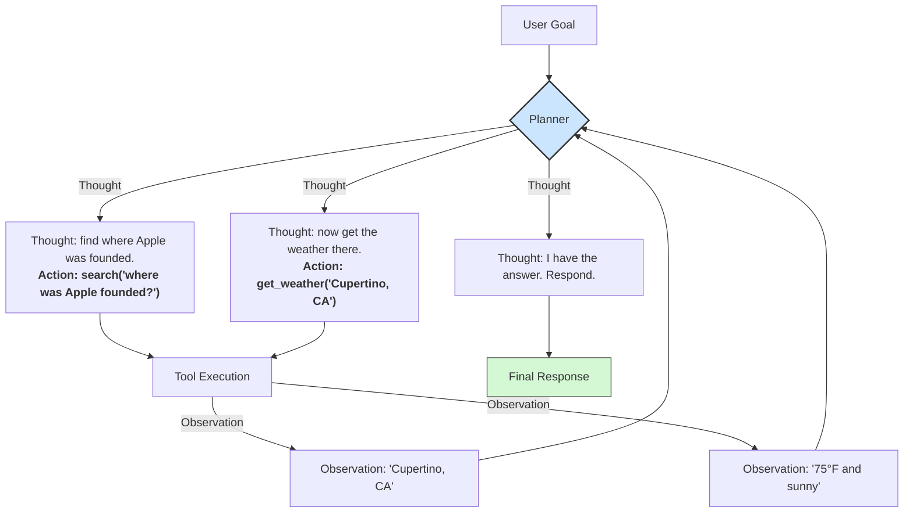

# **Module 5, Lesson 1: The Rise of AI Agents**

### Building on What We've Learned

Welcome to Module 5. So far, we've built systems that can answer questions based on provided information (RAG). We are now moving beyond just *answering* and into the realm of *acting*. An **AI Agent** is a system that uses an LLM not just to generate text, but to make decisions, use tools, and take actions to achieve a goal.

### Learning Objectives

By the end of this lesson, you will be able to:
*   **Define** an AI Agent and differentiate it from a RAG system and from a workflow.
*   **List and describe** the core components: the Planner, the Tools, the Memory — and the harness that holds them.
*   **Diagram** the ReAct (Reasoning + Acting) loop.
*   **Decide** when a problem actually needs an agent.

---

### **1. The Agentic Mindset: From Answering to Doing**

A RAG system is like an "open-book" research assistant. You ask a question, and it finds the answer in its books.

An **agent** is a personal assistant you can give a goal to. It not only reads the books but can also use a phone, a calculator, or a calendar to get the job done.

The agent follows a dynamic, cyclical path: **Goal -> Think -> Act -> Observe -> Think -> Act ...** until the goal is complete.

The **agentic mindset** is about giving the AI:
1.  A **Goal** to achieve (e.g., "Book a flight from New York to London for next Tuesday").
2.  A set of **Tools** it can use (e.g., a flight search API, a calendar API).
3.  The **Autonomy** to decide which tools to use, in what order, and with what inputs, to achieve the goal.

---

### **2. The Core Components of an Agent**

**A. The Planner (The "Brain")**
The core LLM. Its job is to reason about the user's goal and create a plan. It is responsible for:
*   **Decomposition:** Breaking a complex goal ("Plan my weekend trip") into smaller steps ("1. Find hotels. 2. Check weather.").
*   **Tool Selection:** Deciding which available tool is right for the current step.
*   **Reasoning:** Analyzing the results of tool calls ("Observations") to decide what to do next.

**B. The Tools (The "Hands")**
A set of functions or APIs that the agent can call to interact with the world. The agent *cannot* perform actions directly; it can only invoke the tools you give it.
*   `search_flights(origin, destination, date)`
*   `send_email(recipient, subject, body)`
*   Even your RAG retriever is a tool! `search_knowledge_base(query)`

**C. The Memory (The "Scratchpad")**
The context that persists between steps. It stores:
*   The user's original goal.
*   The multi-step plan.
*   The results of previous tool calls (Observations), which are crucial for the next step of the plan.

---

### **3. The Agentic Loop: ReAct (Reason + Act)**

One of the most common agentic frameworks is called **ReAct**. It formalizes the "Think, Act, Observe" cycle.

**Diagram: A ReAct Loop in Action**
*   **Goal:** "What's the weather in the city where Apple was founded?"

This loop continues until the Planner decides it has enough information to satisfy the goal.

> **Note that last sentence carefully — it contains the central weakness of the naive agent.** "Until the Planner decides" means the model grades its own homework. In Module 8 we replace this with an external verification step, because a model asked whether it has finished will very often say yes. For now, hold onto ReAct as the *reasoning* pattern it is, and remember that the *stopping* half needs work.

---

### **4. Agent, Workflow, or Neither?**

Before building an agent, it's worth knowing that agents are the *expensive* answer, and often not the right one.

| | Workflow | Agent |
| :--- | :--- | :--- |
| **Control flow** | You write it | The model decides it |
| **Path** | Fixed and known in advance | Discovered at runtime |
| **Cost** | Predictable | Variable, sometimes wildly |
| **Debugging** | Standard — it's just code | Requires traces and interpretation |
| **Failure** | Deterministic, reproducible | Non-deterministic |

**Use a workflow when you know the steps.** "Fetch the invoice, extract the line items, validate against the PO, flag discrepancies" is four model calls in a `for` loop. Wrapping that in an agent and hoping it discovers the sequence adds cost, latency, and non-determinism to a problem you had already solved.

**Use an agent when the path genuinely depends on what's found.** Debugging, research, and open-ended exploration have this property: step three is unknowable until step two returns.

> **A useful test:** if you can draw the flowchart, build the flowchart. The moment the flowchart needs a box saying "figure out what to do next," you have an agent.

Most production systems are workflows with an agentic step or two inside them — not one agent doing everything. That composition is usually the right target.

---

### **5. A Preview: The Agent Is Not Just the Model**

Everything above describes the *concept* of an agent. Building one that works in production requires something else, and it's worth naming now so the next lessons land in the right frame:

> **`Agent = Model + Harness`**

The **harness** is all the code around the model: how tools are dispatched and how their errors are handled, what goes into the context on each turn, what the agent is permitted to do, how the loop terminates, and what gets logged. Most agent failures in production are harness failures, not model failures — swapping in a better model doesn't fix them.

Module 8 is devoted to this. The next three lessons build the pieces: tools, capability packaging, and architectures.

Next up: the most important part of the system after the model itself — designing and describing tools so the agent can actually use them.

---

### **Key Takeaways**

*   An **AI Agent** uses a model to reason, plan, and use tools to achieve a goal.
*   Core components: the **Planner** (brain), **Tools** (hands), **Memory** (scratchpad) — plus the **harness** that holds them together.
*   **ReAct** cycles **Thought → Action → Observation**. It is a strong *reasoning* pattern with a weak *stopping* condition, which Module 8 fixes.
*   **If you can draw the flowchart, build the flowchart.** Agents are for when the path is genuinely unknown in advance.
*   **`Agent = Model + Harness`.** Most production failures live in the harness.

### **Hands-On Task: Single Call, RAG, Workflow, or Agent?**

For each scenario, decide whether you need a **single model call**, a **RAG system**, a **workflow**, or an **agent**. Explain your reasoning — and where you choose an agent, say what specifically makes the path unknowable in advance.

1.  A user asks, "What is the capital of France?" You have a knowledge base of world facts.

2.  A user says, "Email my team about the 3 PM meeting and include today's weather forecast."

3.  A user asks, "Summarize the attached meeting transcript."

4.  Every night, for each new support ticket: classify it, look up the customer's plan, draft a reply, and queue it for human review.

5.  "Our checkout conversion dropped 8% yesterday. Find out why."

6.  A user uploads a CSV and asks, "What's interesting in this data?"

**Then:** for the two you classified as agents, sketch what a *workflow* version would look like and name the specific thing it would fail at. If you can't name it, reconsider your classification.