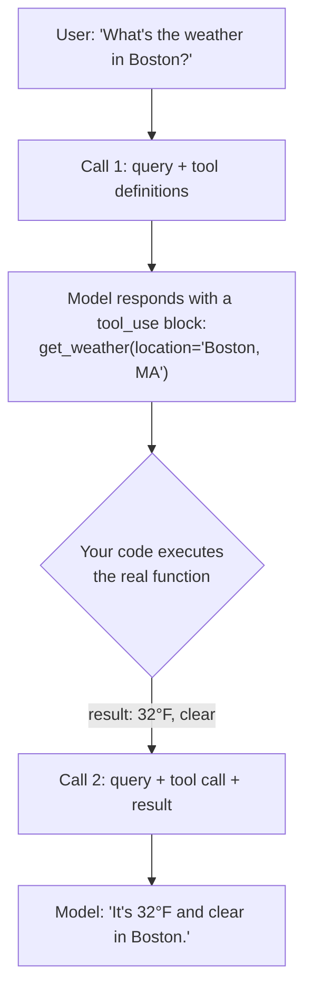

# **Module 5, Lesson 2: Designing and Integrating Tools**

### Building on What We've Learned

An agent is only as capable as its tools — and, less obviously, only as *reliable* as its tool **descriptions**. Those descriptions sit in the context window on every single turn. They are prompt surface, and they are the part of an agent that engineers most consistently under-invest in.

### Learning Objectives

By the end of this lesson, you will be able to:
*   **Write** a tool specification in JSON Schema.
*   **Apply** the principles that separate tools an agent uses correctly from ones it fumbles.
*   **Design** tool *results* for token efficiency and error recovery.
*   **Diagnose** tool-set bloat and prune it.

---

### **1. The Core Idea: Describing Your Tools**

The model doesn't execute your code — that would be a serious security problem. It emits a structured object saying **"call this function with these arguments."** Your code parses it, runs the function, and returns the result.

For that to work you must describe your tools in a schema the model can read.

```python
tools = [{
    "name": "get_weather_forecast",
    "description": (
        "Get the current weather forecast for a location. Returns temperature, "
        "conditions, and a 3-day outlook. Use this for questions about current "
        "or upcoming weather — NOT for historical weather, which is "
        "`get_weather_history`."
    ),
    "input_schema": {
        "type": "object",
        "properties": {
            "location": {
                "type": "string",
                "description": "City and region, e.g. 'San Francisco, CA' or 'Paris, France'.",
            },
            "unit": {
                "type": "string",
                "enum": ["celsius", "fahrenheit"],
                "description": "Defaults to the local convention for the location.",
            },
        },
        "required": ["location"],
    },
}]
```

> **Anatomy of a good description**
> *   **`name`** — the exact function name.
> *   **`description`** — what it does, **what it returns**, and **when to use it versus a similar tool**. That last clause is the one people omit and the one that prevents the most errors.
> *   **`properties` descriptions** — what each parameter is and, critically, *what format*. `"City and region, e.g. 'San Francisco, CA'"` teaches the model the shape by example.
> *   **`enum`** — constrain to valid values. The model cannot then produce an invalid one.
> *   **`required`** — what's mandatory.

---

### **2. The Two-Step Execution Loop**



1.  **Decide.** You send the query plus tool definitions. The model responds with a tool-use block instead of text.
2.  **Execute.** You parse it, run your actual function.
3.  **Synthesize.** You send the result back. The model now has the data and answers.

This `user → model → tool → model → user` cycle is the atom of every agent.

---

### **3. Principles for Tools Agents Use Correctly**

**A. Prune ruthlessly. Tool-set bloat is the top cause of wrong tool selection.**

The diagnostic is precise and worth memorizing:

> **If a human engineer can't say definitively which tool applies in a given situation, an agent can't either.**

Take your tool list and, for each pair, ask "when would I use A rather than B?" If you hesitate, the model will do worse than hesitate — it will pick, confidently, at random. The fix is usually to merge the pair into one tool with a parameter, or to delete one.

Tools also cost tokens on every turn. Twenty tools at 150 tokens each is 3,000 tokens of permanent overhead — which is both a cache-friendly cost and an attention cost.

**B. Make tools self-contained.**

A tool requiring the agent to have called two other tools first, in order, is a tool that will be called wrong. Prefer `get_customer_orders(email)` over the sequence `lookup_customer_id(email)` → `get_orders(customer_id)`. Push the orchestration into your code, where it's deterministic and free.

**C. Return errors the agent can act on.**

This is the single highest-value change in most tool implementations, and it costs almost nothing.

```python
# Useless — the agent has no move.
return {"error": "Not found"}

# Actionable — the agent recovers on its own next turn.
return {
    "error": "No customer with email 'jon@acme.com'.",
    "hint": "Did you mean 'john@acme.com'? Use search_customers(name=...) for fuzzy lookup.",
    "similar": ["john@acme.com", "jon@acmecorp.com"],
}
```

The second turns a dead end into a recovery. Design your error paths as carefully as your success paths — the agent reads them just as attentively, and they arrive at exactly the moment the agent most needs guidance.

**Report every problem with a call, not the first one.** A typo like `e_mail` for `email` is *simultaneously* a missing required argument and an unknown argument. Report only the first and the agent adds `email` — while still sending `e_mail`, because nothing told it that key was wrong. Two turns wasted on one typo.

**D. Never let a tool error raise into the loop.**

Catch it and return it as a tool result. An exception that propagates kills the run; an error the model can read is just another observation.

**E. Design results for the context budget.**

Tool results accumulate in the context window (Module 4, Lesson 4). A tool that returns 8,000 tokens of JSON has spent a large slice of the budget on one call.

```python
# Bad — dumps everything.
return db.query("SELECT * FROM orders WHERE customer_id = ?", cid)   # 400 rows

# Good — summarize, offload, and offer a path to the detail.
return {
    "count": 400,
    "date_range": "2024-01-03 to 2026-08-19",
    "total_value_usd": 84_320,
    "most_recent": rows[:3],
    "full_results": "/tmp/orders_8823.json",   # agent can grep or read ranges
    "note": "Use query_orders(customer_id, filters) to narrow.",
}
```

**Give the tool a `limit` or `detail` parameter** so the agent can ask for more when it needs it — just-in-time retrieval applied to tool output.

**F. Make destructive tools hard to call by accident.**

Separate reads from writes. Require explicit confirmation parameters on irreversible actions (`delete_records(ids, confirm=True)`). Best of all, don't give the agent the destructive tool at all — have it produce a proposal that a separate, non-agentic process executes under its own limits.

---

### **4. Tool Descriptions Are Prompt Surface**

Worth stating plainly, because it changes how you treat these strings:

**Every word in a tool description is in the model's context on every turn.** They are not documentation — they are instructions, and they compete for attention with everything else.

This means:
*   **Rewriting a description is a behavior change.** Version it and re-run your evals (Module 6).
*   **A tool description is a good place for a usage rule.** *"Always call `check_inventory` before `create_order`."* is more reliably followed inside the tool description than buried in a long system prompt, because it's adjacent to the decision.
*   **They can be too long.** Aim for a description that fully disambiguates and stops. A paragraph per tool across twenty tools is a system prompt's worth of overhead you didn't intend to write.

> **Pro-Tip: Read your traces for tool errors, not just task failures**
> The most common signal that a tool description needs work is the agent calling a tool with malformed arguments, retrying with different arguments, or calling a tool and immediately calling a different one. Count these per tool. The tool with the worst ratio is where an hour of description-writing buys the most.

---

### **Key Takeaways**

*   You give the model a **description** of your code, not the code. That description is **prompt surface** on every turn.
*   The execution loop is **decide → execute → synthesize**, and it's the atom of every agent.
*   **Prune ruthlessly:** if a human can't say which of two tools applies, neither can the agent.
*   **Errors should be actionable**, and must never raise into the loop. Design error paths as carefully as success paths.
*   **Design results for the token budget:** summarize, offload the bulk, and offer a `limit`/`detail` parameter.
*   **Separate reads from writes**, and make irreversible actions hard to call by accident.

### **Hands-On Task: Design and Prune**

**Part A — Write a specification.** For the function `search_products(query: str, category: str = None, on_sale_only: bool = False)`, write the complete JSON Schema definition. Correct types, a clear description of the tool *and* each parameter, `query` required, and `category` constrained by `enum` to `["electronics", "apparel", "home_goods"]`.

**Part B — Design the result.** The search can match 2,000 products. Design what the tool *returns*, given that this result lands in the context window alongside everything else. Show the shape for a 2,000-match query and for a 3-match query — and say what parameter you'd add to the input schema as a consequence.

**Part C — Prune a bloated tool set.** An e-commerce agent has these fourteen tools:

```
search_products          get_product_details      get_product_by_sku
find_similar_products    check_inventory          check_stock_level
get_price                get_discounted_price     apply_coupon
get_customer             get_customer_orders      get_order
cancel_order             delete_order
```

1.  **Find every pair a human couldn't confidently choose between.** There are at least four.
2.  **Prune to seven or fewer.** For each removal, say whether it's a merge (into what, with what parameter) or a deletion (and why nothing is lost).
3.  **Fix the dangerous pair.** `cancel_order` and `delete_order` are both destructive and nearly indistinguishable by name. Redesign this so a mistake is structurally difficult, not merely discouraged.
4.  **Write one description properly.** Take your merged product-search tool and write its full description, including the "when to use this versus X" clause. Then count its tokens and multiply by the number of turns in a typical session — is it worth what it costs?
