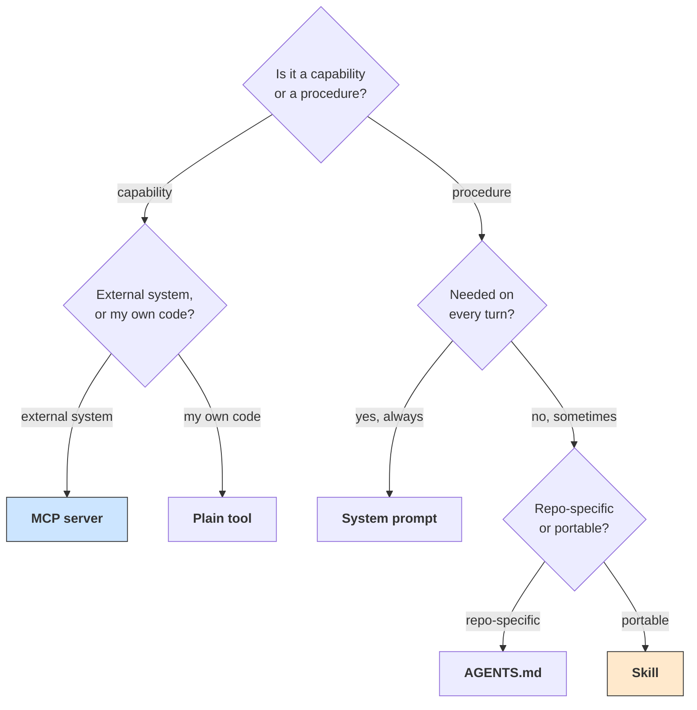

# **Module 5, Lesson 4: MCP and Agent Skills — Packaging Capability**

### Building on What We've Learned

You know how to define a tool and how to prune a tool set. Now the scaling problem: an enterprise agent might need to reach thirty internal services and perform a hundred distinct procedures. Hand-writing schemas for all of them, and holding them in context simultaneously, doesn't work — you'd exhaust both your engineering time and your attention budget.

Two standards solved two different halves of this. Knowing which solves which is the point of this lesson.

### Learning Objectives

By the end of this lesson, you will be able to:
*   **Explain** what MCP standardizes and why it changed integration economics.
*   **Describe** Agent Skills and the progressive-disclosure mechanism that makes them scale.
*   **Choose** correctly between a tool, an MCP server, a skill, and a project instructions file.
*   **Assess** the security implications of installing third-party capability.

---

### **1. MCP: Connecting Agents to Tools and Data**

**The problem it solved** was combinatorial. Before MCP, connecting *M* agent applications to *N* data sources meant *M × N* bespoke integrations — everyone writing their own Slack connector, their own Postgres connector, their own GitHub connector, none of them reusable.

**The Model Context Protocol** makes that *M + N*: a data source implements one MCP server, and every MCP-capable agent can use it.

An MCP server exposes three kinds of thing:
*   **Tools** — functions the agent can call (`query_database`, `create_issue`).
*   **Resources** — data the agent can read (files, records, schemas).
*   **Prompts** — reusable templates the server offers.

```python
# Your agent connects to servers rather than defining every tool by hand.
mcp_servers = [
    {"name": "postgres", "command": "mcp-server-postgres", "args": ["--dsn", DSN]},
    {"name": "github",   "command": "mcp-server-github",   "env": {"TOKEN": GH_TOKEN}},
]
# Tool schemas are discovered from the servers at connect time.
```

**Where MCP stands in 2026.** It is genuinely ubiquitous — its official SDKs have crossed a billion cumulative downloads. The most consequential recent change is architectural: the **July 2026 specification removed transport-level session management**, giving MCP a stateless core that scales behind ordinary HTTP load balancers. It also added multi-round-trip requests, cacheable list results, and a formal extensions framework, with long-running tasks moving into a `tasks` extension.

*Practical consequence:* an MCP server is now a normal horizontally-scalable web service. If you built around sticky sessions, that's your migration.

**MCP doesn't repeal Lesson 2.** Connecting five MCP servers can inject sixty tool definitions into your context. Everything about tool-set bloat still applies — arguably more so, because the bloat now arrives by default rather than by choice. Most mature agent runtimes therefore support **tool filtering** (expose only a subset of a server's tools) or **tool search** (load definitions on demand rather than all at startup). Use them.

---

### **2. Agent Skills: Packaging Procedures**

MCP gives an agent *reach*. Skills give it *know-how*.

A **skill** is a folder containing a `SKILL.md` — instructions for performing a specific task — plus any scripts, templates, or reference files it needs.

```
skills/
  incident-postmortem/
    SKILL.md              # the procedure
    template.md           # the output format
    scripts/
      fetch_timeline.py   # a helper the agent can run
```

```markdown
---
name: incident-postmortem
description: Write a blameless postmortem from an incident ID. Use when asked to
  document, write up, or analyze a resolved production incident.
---

# Incident Postmortem

## Steps
1. Run `scripts/fetch_timeline.py <incident_id>` to assemble the raw timeline.
2. Identify the trigger, the contributing factors, and the detection gap.
3. Write the postmortem using `template.md`.
4. Every claim in the Timeline section must cite a log line or trace ID.

## Rules
- Blameless: describe systems and decisions, never individuals.
- If the root cause is genuinely unknown, say so explicitly. Do not speculate.
```

**Progressive disclosure is the mechanism that makes this scale**, and it's a context-engineering idea in packaging form:

| Tier | What loads | Cost | When |
| :--- | :--- | :--- | :--- |
| 1 | `name` + `description` only | ~30–50 tokens per skill | Always |
| 2 | Full `SKILL.md` | ~500–2,000 tokens | When the task matches |
| 3 | Referenced files and scripts | Variable | Only if execution needs them |

**The consequence is that capability becomes sub-linear in context cost.** An agent can have 200 skills available for roughly 8,000 tokens of descriptions, and pay the full cost of only the one it actually uses. Compare the alternative: 200 procedures in a system prompt is a system prompt nobody can maintain and no model can attend to.

**Adoption.** Released as an open standard in December 2025, adopted across the major agent platforms within weeks. Public directories now index enormous catalogs of community skills.

---

### **3. Choosing: Tool, MCP Server, Skill, or Instructions File**

The most common design mistake here is putting a procedure in a system prompt because it seemed simplest at the time.

| Use | When | Example |
| :--- | :--- | :--- |
| **A plain tool** | One function, in your own codebase, specific to this agent | `calculate_shipping(weight, zone)` |
| **An MCP server** | Connecting to a *system* — a database, SaaS product, or API — especially if more than one agent needs it | Your Postgres, Jira, or S3 |
| **A skill** | A *procedure* with multiple steps, reused across tasks or agents, that shouldn't cost context when unused | Your 40-step onboarding process |
| **AGENTS.md** | Ambient project knowledge every agent touching this repo needs | "We use `uv`, not `pip`. Don't touch `legacy/`." |
| **The system prompt** | Behavior that applies to *every* turn of *this* agent | Persona, output contract, hard rules |



**The test that resolves most cases:** *"If the agent never does this task, should I still pay for these tokens?"* If no, it's a skill.

---

### **4. The Security Cost of Installed Capability**

This is the part that gets skipped, and it's the part with real consequences.

**An MCP server or a skill is executable capability you are granting an agent.** Installing one from a public registry is closer to `npm install` than to reading documentation — with the added property that its instructions go into your model's context and are read as guidance.

**Concrete risks:**

*   **Malicious or compromised servers.** An MCP server sees every argument the agent passes it — which may include credentials, customer data, or proprietary content. It also runs code on your infrastructure.
*   **Skills as an injection vector.** A `SKILL.md` is instructions loaded into context. A malicious skill can contain instructions that redirect the agent, exfiltrate data, or disable your guardrails — and it will be read with the authority of something you installed deliberately.
*   **Silent updates.** A server or skill that changes behavior after you audited it. **Pin versions.**
*   **Permission accumulation.** Five MCP servers, each reasonable alone, can together assemble the lethal trifecta: one reads untrusted content, one holds private data, one acts outward (Module 6, Lesson 3).

**Practices worth adopting before you need them:**
*   **Read the source of anything you install.** For a skill, that means reading the `SKILL.md` in full — it is a prompt you are adding to your system.
*   **Pin versions**, and review diffs on upgrade.
*   **Scope credentials per server.** The Jira server gets a Jira token with the narrowest scope that works — not a shared admin credential.
*   **Prefer running servers you control.** Self-host, or vendor the code.
*   **Audit the *combination*.** Review your whole capability set for the trifecta, not each addition in isolation. This is the check nobody runs, and it's the one that catches the real problem.

> **The uncomfortable framing:** if you wouldn't `curl | bash` a script from this source, don't install its MCP server. The trust model is the same, and the blast radius is larger — because the agent will use it autonomously, at scale, while you're asleep.

---

### **Key Takeaways**

*   **MCP** standardizes agent → tools/data, turning *M × N* integrations into *M + N*. It went **stateless** in the July 2026 spec, so servers now scale as ordinary web services.
*   MCP doesn't repeal tool-set discipline — **filter or lazily load** tools from connected servers.
*   **Agent Skills** package procedures, and **progressive disclosure** makes capability sub-linear in context cost: ~40 tokens per skill until one is used.
*   Choose by asking **"capability or procedure?"** and **"should I pay for this when unused?"**
*   Installed capability is **executable trust**. Read skill sources, pin versions, scope credentials per server, self-host what matters, and **audit the combination for the lethal trifecta**.

### **Hands-On Task: Package a Capability Set**

**Scenario.** You're building an internal engineering assistant that must:

*   Query the production Postgres read replica.
*   Read and comment on GitHub PRs.
*   Search the team's Notion documentation.
*   Follow the team's 12-step release checklist.
*   Follow the team's 20-step incident-response runbook.
*   Know that this repo uses `pnpm`, that `packages/legacy/` is frozen, and that all PRs need two approvals.
*   Always respond concisely and never claim a test passed without running it.

**Part A — Package each.** For each of the seven requirements, choose a tool, an MCP server, a skill, AGENTS.md, or the system prompt. Justify each in one line.

**Part B — Count the context.** Estimate the always-loaded token cost of your design. Then estimate what it would be if the two runbooks lived in the system prompt instead. What's the difference per turn, and across a 40-turn session?

**Part C — Audit the trifecta.** Your assistant reads GitHub PR descriptions (written by anyone, including external contributors), queries production data, and can post comments.

1.  Identify the three legs precisely.
2.  Describe a concrete attack in three sentences.
3.  Propose the smallest change that breaks it, and state what capability the assistant loses.

**Part D — Vet a skill.** A colleague found a popular public skill, `deploy-helper`, that automates your deployment flow and would save real time. Write the five-item checklist you'd complete before installing it — and name the one item that, if it failed, would make you reject the skill outright regardless of the others.
