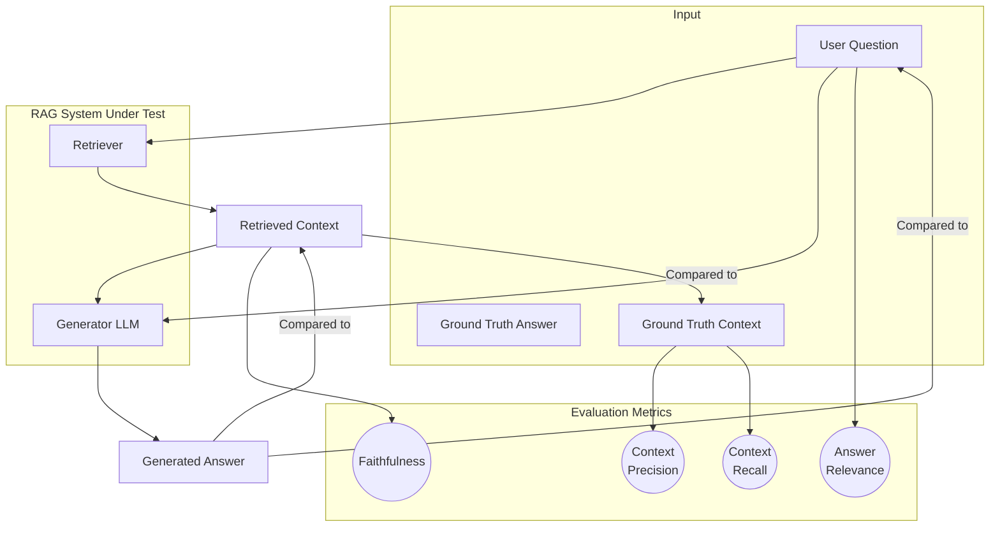

# **Module 6, Lesson 1: Evaluating Context Quality and Agent Performance**

### Building on What We've Learned

Welcome to Module 6. We've focused on *building* systems. Now, we'll focus on *validating* them. How do you know if your RAG system is any good? How can you tell if a change to your prompt made things better or worse? This process is called **RAG-eval**.

### Learning Objectives

By the end of this lesson, you will be able to:
*   **Define** the four key RAG metrics: Context Precision, Context Recall, Faithfulness, and Answer Relevance.
*   **Evaluate an agent's trajectory**, not just its final answer.
*   **Calibrate** an LLM judge, and explain why an uncalibrated one is worthless.
*   **Design** an evaluation dataset that is actually large and varied enough to trust.

---

### **1. The Four Pillars of RAG Evaluation**

We need to evaluate the two main parts of our pipeline separately: "Did I retrieve the right stuff?" (Retrieval) and "Did I generate a good answer from it?" (Generation).

**A. Evaluating the Retriever**

1.  **Context Precision:**
    *   **Question:** Of all the documents I retrieved, how many were actually relevant?
    *   **Why it matters:** Low precision means your retriever is adding "noise" to the context, which increases costs and can confuse the Generator.

2.  **Context Recall:**
    *   **Question:** Of all the relevant documents that *exist* in the knowledge base, did I find them?
    *   **Why it matters:** Low recall means your retriever is failing to find the necessary information, even when it exists. This leads to the model saying "I don't know" when it should have known the answer.

**B. Evaluating the Generator**

3.  **Faithfulness:**
    *   **Question:** Does the final answer stick *only* to the facts provided in the retrieved context?
    *   **Why it matters:** This is a direct measure of **hallucination**. A low faithfulness score means the LLM is making things up.

4.  **Answer Relevance:**
    *   **Question:** Does the final answer actually address the user's original question?
    *   **Why it matters:** It's possible to have a faithful answer that is completely useless. If the answer is factually correct but doesn't answer the *user's specific question*, it has low relevance.

A good RAG system must score well across **all four** of these metrics.

**Diagram: The Evaluation Pipeline**


---

### **2. Automating Evaluation with Frameworks**

Manually checking these metrics is tedious. Frameworks use LLMs as "judges" to automate this process.
*   **RAGAs (RAG Assessment):** A popular framework focused specifically on the four key metrics above.
*   **TruLens:** A more comprehensive framework that not only calculates metrics but also helps you trace the entire execution of your app, so you can see the inputs and outputs of every component.

These frameworks all depend on one critical thing: a good **evaluation dataset**. This is a set of question-answer pairs that represent the kinds of queries you expect from your users.

**Anatomy of a High-Quality Evaluation Item:**
*   `question`: The question to ask the RAG system.
*   `ground_truth_answer`: The ideal, human-written answer.
*   `ground_truth_context`: The specific document chunks that contain the information needed to answer the question. This is required to measure recall.

**Example of a Synthetic Dataset Item:**
```json
{
  "question": "How do I add a new user to my team account?",
  "ground_truth_answer": "To add a new user, you must be an admin. Go to Settings > Team Management, and click the 'Invite User' button.",
  "ground_truth_context": [
    "Admin-level permissions are required to manage team members. The 'Invite User' functionality is located in the Team Management section of the account settings page."
  ]
}
```
Building this dataset is the most labor-intensive part of RAG evaluation, but it is also the most important. Without a high-quality set of test cases, your metrics are meaningless.

---

### **3. A Modern Approach: Natural Language Unit Testing**

While frameworks like RAGAs provide high-level scores across the four pillars, a new, more granular approach is emerging: **natural language unit testing**.

Pioneered by frameworks like **LMUnit**, this paradigm brings the discipline of software engineering to LLM evaluation. Instead of just getting a single score for "Faithfulness," you write a series of clear, pass/fail checks in plain English.

**How it Works:**
An LLM "judge" is given the prompt, the response, and a specific "unit test" to evaluate.

**Example Unit Tests for a Response:**
*   **Global Tests (apply to all responses):**
    *   "Is the response succinct and to the point?"
    *   "Does the response maintain a formal and professional tone?"
    *   "Does the response avoid making up information not present in the context?" (This is a unit test for faithfulness).
*   **Targeted Test (for a specific question):**
    *   Query: "What is the capital of France?"
    *   Unit Test: "Does the response correctly identify Paris as the capital?"

This approach is powerful because it gives you highly specific, actionable feedback. If your application fails the "professional tone" test, you know exactly what to fix in your system prompt. It moves evaluation from a vague, numeric score to a clear, interpretable, and debuggable process.

---

### **4. Evaluating Agents: The Trajectory Is the Unit**

Everything above evaluates a *response*. An agent produces a **trajectory** — a sequence of decisions, tool calls, observations, and recoveries — and the final answer is only its last step.

Evaluating only the final answer misses almost everything that matters. An agent can produce a correct answer having called eleven tools when two would do, looped twice, and gotten lucky. Next week, on a slightly different input, it won't get lucky.

**Six dimensions, scored separately:**

| Dimension | The question | Failure it catches |
| :--- | :--- | :--- |
| **Tool selection** | Did it choose the right tool at each step? | Tool-set bloat, weak descriptions |
| **Argument extraction** | Were the arguments correct and well-formed? | Ambiguous parameter descriptions |
| **Result utilization** | Did it actually use what the tool returned? | Tool results buried mid-context |
| **Error recovery** | When a tool failed, did it recover sensibly? | Unhelpful error messages |
| **Plan coherence** | Did the steps make sense as a sequence? | Wrong architecture; goal too vague |
| **Task completion** | Was the goal actually achieved? | Everything else |

Scoring these separately is what makes an eval *diagnostic* rather than merely a grade. A single "success rate" tells you an agent got worse. Six dimensions tell you *tool selection* got worse after you added three tools — which is a fix, not an investigation.

**Add the operational dimensions once you're in production:** cost per task, wall-clock latency, number of turns, and escalation rate. An agent that improved accuracy by 2 points while tripling cost has not necessarily improved.

> **A structural limitation to know about.** As agents run longer, LLM judges struggle: a full trajectory may not fit in the judge's context, and a judge cannot verify that a *stateful change* actually happened — it sees the agent's claim that a record was updated, not the database. For long-horizon agents, prefer **checking the world** (query the record, run the test, diff the file) over asking a judge to read the transcript. Reserve judges for the parts that are genuinely qualitative.

---

### **5. Calibrating an LLM Judge**

Most evaluation now depends on models judging models. This works — but only if you do one step that's easy to skip.

**An uncalibrated judge is a random number generator with good manners.** It will produce scores, they will look plausible, and you have no idea whether they correlate with anything.

**Calibration, minimally:**

1.  **Label 50–100 examples by hand**, spanning clearly good, clearly bad, and genuinely borderline.
2.  **Run the judge** on the same examples.
3.  **Measure agreement** — Cohen's kappa, or simple correlation for scalar scores.
4.  **If agreement is poor, fix the rubric, not the judge model.** Nearly always the rubric is vague ("is the answer helpful?") where it needs to be specific ("does the answer address every part of a multi-part question? Score 0 if any part is unaddressed").
5.  **Re-check periodically**, and always after changing the judge model or the rubric.

**Known judge biases worth designing against:**
*   **Position bias** — in pairwise comparisons, judges favour whichever came first. Randomize order, or run both orders and average.
*   **Verbosity bias** — longer answers score higher regardless of quality. State length expectations in the rubric.
*   **Self-preference** — a judge tends to prefer output from its own model family. Use a different model as judge where you can.

---

### **6. How Big Does an Eval Set Need to Be?**

Bigger than most teams' first attempt, and the reason is arithmetic rather than perfectionism.

With **20 test cases**, a change from 15 failures to 13 is well within noise — you cannot distinguish a real 10% improvement from chance. Teams routinely ship regressions on the strength of an eval set that couldn't have detected them.

**Practical guidance:**
*   **10–30 cases:** a smoke test. Catches catastrophic breakage. Do not make ship decisions from it.
*   **~100 cases:** enough to detect large regressions.
*   **300–500+ cases:** enough for aggregate metrics you can act on, and to slice by task type.

**Stratify rather than sample randomly.** Deliberately include: easy cases, hard cases, edge cases, adversarial inputs, and every failure you've seen in production. That last category is the most valuable and the cheapest — **every production failure should become an eval case the same day**, or you will fix it and re-break it.

> **Start the eval set before you build.** It is the single most-skipped step and the one that most reliably determines whether a team can improve their system. Without it, every change is a guess, and "it seems better" is the only available evidence.

---

### **Key Takeaways**

*   RAG evaluation measures the **Retriever** (Context Precision & Recall) and the **Generator** (Faithfulness & Answer Relevance). **Faithfulness** is the direct hallucination metric.
*   For agents, **the trajectory is the unit of evaluation.** Score six dimensions separately — tool selection, arguments, result use, error recovery, plan coherence, completion — because separate scores are diagnostic and a single score is not.
*   For long-horizon agents, **check the world** rather than asking a judge to read the transcript. Judges can't verify stateful changes.
*   **Calibrate your judge against human labels**, and fix the *rubric* when agreement is poor. Design against position, verbosity, and self-preference bias.
*   **Eval set size determines what you can detect.** Under ~100 cases you cannot distinguish improvement from noise. Every production failure becomes an eval case the same day.
*   **Build the eval set before the system.** Without it, every change is a guess.

### **Hands-On Task: Evaluate a System's Output**

**Scenario:**
*   **User Question:** "How do I reset my password?"
*   **Retrieved Context:** `[ "Users can change their password in the 'Security' section of their account settings. Two-factor authentication is required." ]`
*   **Generated Answer:** "To change your password, go to your account settings."

**Part A — Score the four pillars.** Rate each **Good**, **Okay**, or **Poor**, with justification.
1.  **Context Precision** — assume the retrieved context was the only thing retrieved.
2.  **Context Recall** — assume the knowledge base also contains: *"Password resets can also be initiated from the login screen."*
3.  **Faithfulness**
4.  **Answer Relevance**

**Part B — Score a trajectory.** A support agent was asked: *"Why was I charged twice last month?"* Its trajectory:

```
1. search_kb("double charge")        → 5 generic billing articles
2. search_kb("duplicate charge")     → 5 similar articles
3. search_kb("charged twice")        → 4 of the same articles again
4. get_customer(email)               → customer record
5. get_orders(customer_id)           → 12 orders, including 2 identical on Jul 3
6. Final: "I can see two charges on July 3rd. This appears to be a duplicate.
   I've flagged it for our billing team, who will refund within 5 business days."
```

Score each of the six dimensions from section 4, with a one-line justification. Then answer: **the final answer is good — so what exactly is wrong here, and what would you change?**

**Part C — Calibrate a judge.** You're evaluating whether support responses are "appropriately empathetic." Your first rubric is: *"Does the response show empathy? Score 1–5."* Kappa against human labels comes out at 0.31 — poor agreement.

1.  Explain why this rubric produces poor agreement.
2.  Rewrite it so two different people would score the same response the same way.
3.  Name which of the three judge biases most threatens *this particular* metric, and how you'd control for it.