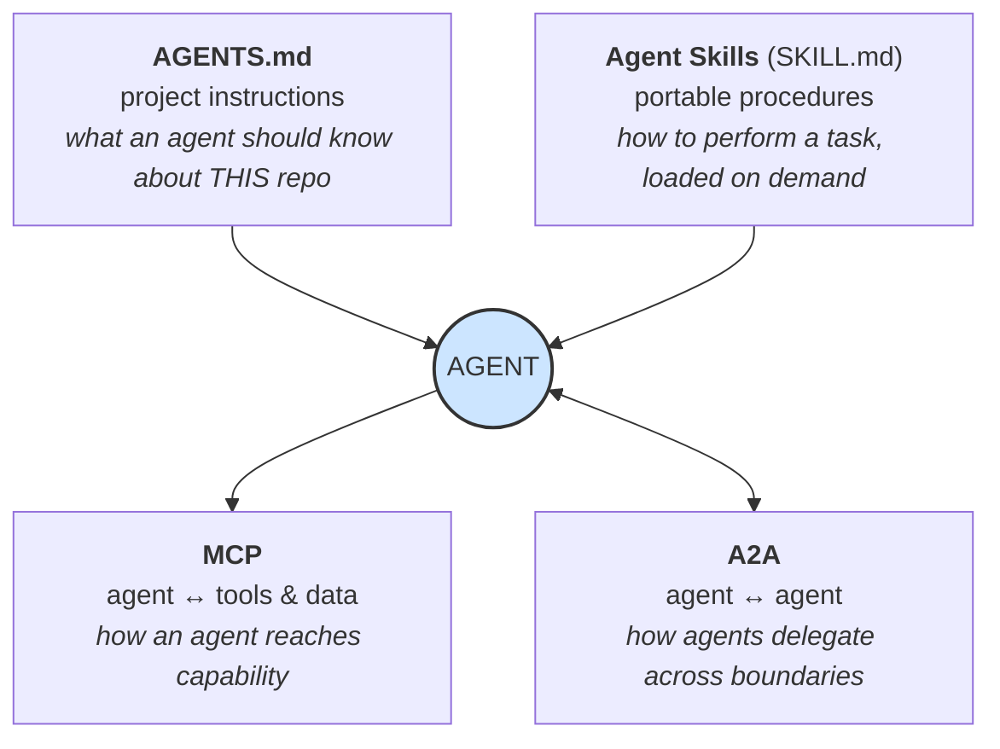

# **Module 7, Lesson 2: The Evolving Landscape**

### Building on What We've Learned

The techniques in this course are stable enough to build on, but the ground underneath them keeps moving. This lesson covers the trends that actually changed practice — not speculation, but shifts that already have adoption numbers attached — and what each one means for how you build.

### Learning Objectives

By the end of this lesson, you will be able to:
*   **Explain** why million-token context windows did not eliminate retrieval, and what they changed instead.
*   **Describe** the state of the interoperability stack: MCP, A2A, AGENTS.md, and Agent Skills.
*   **Assess** self-improving and meta-agent systems, including their real risks.
*   **Anticipate** which parts of your own stack are most likely to be obsoleted next.

---

### **1. The "Infinite" Context Window That Wasn't**

Million-token context windows arrived. By mid-2026, more than a dozen frontier models shipped 1M+ token windows, and several vendors dropped the long-context price premium entirely.

**The prediction was:** "If I can fit all my documents in the window, I won't need retrieval."

**What actually happened:** the constraint moved from *capacity* to *reliability*. Systematic testing across 18 frontier models found that **every one of them degrades as input length grows** — gradually, well before the stated limit, and in ways that don't show up on simple needle-in-a-haystack tests. A model's *effective* context is commonly around 60–70% of its nominal window, and mid-window accuracy can fall by 30% or more.

So the industry's framing shifted:

> **The long-context race stopped being a capacity race and became a reliability race.**

**What this changed in practice:**
*   **Retrieval didn't die; its job changed.** Less "fetch the answer," more "decide what deserves a place in a scarce, degrading window."
*   **Cost became the binding constraint at scale.** Filling a 1M window costs cents on a budget model and around ten dollars on a frontier one — a roughly 70× spread. Model routing (Module 8, Lesson 4, Plane 1) turned into a first-class design decision rather than a default.
*   **Compaction became standard machinery**, not an optimization. If effective context is 60–70% of nominal, then a long-running agent *must* have a strategy for what leaves the window (Module 4, Lesson 4).

---

### **2. The Interoperability Stack Consolidated**

Between 2024 and 2026, four standards settled into distinct, non-overlapping jobs. Knowing which does what saves you from building a fifth.

**MCP (Model Context Protocol) — how an agent reaches tools and data.**
Now genuinely ubiquitous; its Tier 1 SDKs crossed a billion cumulative downloads. The consequential 2026 change was architectural: the **July 2026 specification removed transport-level session management entirely**, giving MCP a stateless core that scales on ordinary HTTP load balancers. It also added multi-round-trip requests, cacheable list results, and a formal extensions framework, with long-running tasks moving out of the experimental core into a `tasks` extension.

*Why you care:* stateless MCP means an MCP server is now a normal horizontally-scalable web service. If you built around sticky sessions, that's the migration.

**A2A (Agent2Agent) — how agents delegate across organizational boundaries.**
Reached **v1.0 under Linux Foundation governance in April 2026**, with 150+ supporting organizations and integration across the major clouds. Agents publish "Agent Cards" advertising capability; other agents discover them, assign tasks, and exchange artifacts.

*The distinction that matters:* **MCP connects an agent to its tools. A2A connects an agent to someone else's agent.** They compose — an A2A-reachable agent typically uses MCP internally.

**AGENTS.md — project instructions.**
The cross-tool convention for telling any coding agent how *this* repository works: build commands, conventions, what not to touch. Now stewarded under the Linux Foundation's Agentic AI Foundation and read natively by most major agent tools. Some tools retain their own file (Claude Code's `CLAUDE.md`, for instance) with a richer layered memory model; the common pattern is AGENTS.md as the shared source of truth with a thin tool-specific layer importing it.

**Agent Skills (SKILL.md) — portable procedures.**
Released as an open standard in December 2025 and adopted across the major agent platforms within weeks. A skill is a folder — instructions, scripts, resources — that teaches an agent to do a specific task. Its defining property is **progressive disclosure**, which is a context-engineering idea wearing a packaging costume:

*   At startup, only each skill's *name and description* load (~30–50 tokens each).
*   The full `SKILL.md` loads only when the task matches.
*   Bundled reference files load only if execution needs them.

*Why this matters more than it sounds:* it makes capability **sub-linear in context cost**. An agent can have access to hundreds of procedures while paying for only the handful it uses — which is exactly the constraint that made single monolithic system prompts stop scaling. Covered in depth in Module 5, Lesson 4.

---

### **3. From Retrieval Pipelines to Agentic Search**

One of the sharper reversals of the period: for code, **agentic search largely displaced vector RAG**.

The pattern — `glob` → `grep` → read → follow imports → run the tests — outperformed vector retrieval in production coding tools, and the major agent products dropped their vector indexes accordingly. Research comparing the two found grep generally more accurate, with a caveat worth remembering: **the harness mattered more than the retrieval algorithm** (Module 8, Lesson 1).

This does *not* generalize to "RAG is dead." Vector retrieval remains the right tool for large unstructured corpora with fuzzy semantic queries — support tickets, policy documents, research literature. What changed is that it stopped being the *default* answer to "how does my agent find things," and became one option among several. Module 3, Lesson 5 covers how to choose.

---

### **4. Self-Improving Systems and Meta-Agents**

The 2025 edition of this course listed "self-improving systems" as a horizon goal. They shipped.

A **meta-agent** is an agent whose subject is another agent: it reads failure traces and eval results, then modifies the target agent's prompts, tool descriptions, or orchestration — and re-evaluates. Open-source meta-agent frameworks have taken top positions on agent benchmarks after a day of autonomous optimization, beating hand-engineered entries. Research systems have gone a step further, modifying not just behavior but the mechanism that generates future improvements. Large-scale production deployments now run end-to-end ML lifecycles this way — generating hypotheses, launching training, debugging failures, iterating.

**The context-engineering shape of this** is a closed loop: *trace → evaluate → hypothesize a change → apply → re-evaluate → keep or revert.* Everything in Module 6 is the machinery that makes it possible; without a trustworthy eval set, a self-improving system is a random walk with a confident narrator.

**The risks are structural, not hypothetical:**
*   **Eval overfitting.** The meta-agent optimizes for whatever your eval measures. If the eval is narrow, the agent gets better at the eval and worse at the job.
*   **Untraceable drift.** Prompt changes made autonomously, without version control, produce a system nobody can explain or roll back.
*   **Compounding error.** An agent that modifies its own improvement mechanism can move somewhere you can't easily reverse.

The 2026 consensus is unglamorous and correct: **meta-agents propose; humans and held-out evals dispose.** Keep every autonomous change under version control, hold out an eval set the meta-agent never sees, and require a human to promote a change into production.

---

### **5. Observability Grew Up**

Agent tracing stopped being vendor-specific. The **OpenTelemetry GenAI semantic conventions** define standard span names and `gen_ai.*` attributes for model invocations, tool executions, agent runs, retrieval, and memory operations — so a trace emitted by one tool is readable in any OTLP-compatible backend. Major coding agents now emit these directly.

One caveat to carry: as of mid-2026 the conventions remain **pre-stable** — moved into their own repository, but with no 1.0 release, so attribute names can still change. Instrument through a wrapper you control rather than sprinkling raw attribute names through your codebase. Covered in Module 6, Lesson 2.

---

### **6. What to Expect Next**

Rather than predictions, here's the more useful thing: **which parts of your stack are load-bearing and which are likely to be obsoleted.**

| Likely durable | Likely to churn |
| :--- | :--- |
| Context is finite and degrades — the *reason* for every technique here | Specific context-window sizes and prices |
| Verification must be external to the agent | Which eval framework is fashionable |
| Least privilege and blast-radius limits | Specific guardrail products |
| Tool/capability descriptions are prompt surface | Specific SDK APIs |
| Deliberate, budgeted context assembly | Whether you assemble it yourself or a framework does |
| Traces as the unit of debugging | Which observability vendor |

> **The practical takeaway:** invest your learning in the left column and your abstractions in the right. Wrap the churning parts behind interfaces you own, so that replacing an SDK is a day's work rather than a quarter's.

---

### **Key Takeaways**

*   Million-token windows made **reliability**, not capacity, the constraint. Effective context is typically 60–70% of nominal, so retrieval and compaction remain essential.
*   Four standards settled into distinct jobs: **AGENTS.md** (project instructions), **Agent Skills** (portable procedures with progressive disclosure), **MCP** (agent → tools, now stateless), **A2A** (agent → agent, now v1.0 under the Linux Foundation).
*   **Agentic search displaced vector RAG for code** but not everywhere — vector retrieval still wins on large fuzzy corpora.
*   **Meta-agents are real and effective**, and require held-out evals, version control, and human promotion gates to be safe.
*   **OpenTelemetry GenAI conventions** made agent traces portable, though they remain pre-stable.
*   Invest in the durable principles; wrap the churning implementations behind your own interfaces.

### **Hands-On Task: Standards Triage**

**Part A — Route each requirement to the right standard.** For each, name which of AGENTS.md / Agent Skills / MCP / A2A you'd use, and say in one sentence why the others don't fit.

1.  Your agent needs to query your company's Postgres database and your Jira instance.
2.  Every coding agent that touches your repo should know that you use `uv`, not `pip`, and that `legacy/` is off limits.
3.  Your finance team's invoice-reconciliation agent needs to request a shipping status from a *supplier's* agent, at another company.
4.  You have a 40-step internal procedure for onboarding a new customer that three different agents need to perform identically.

**Part B — The obsolescence audit.** Pick a system you've built or designed in this course. List its five most important dependencies (a model, a framework, a vector DB, a protocol, a platform). For each, answer:

*   Is this a **durable principle** or a **churning implementation**?
*   If it were deprecated tomorrow, how many days to replace it?
*   If that answer is more than a week, what interface would you introduce today to shorten it?
