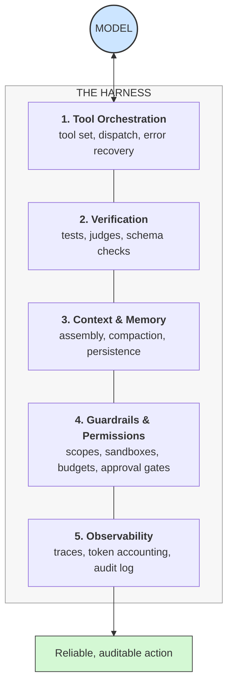

# **Module 8, Lesson 1: The Harness — Where Agents Actually Succeed or Fail**

### Building on What We've Learned

In Module 5 you built an agent: a model, some tools, and a ReAct loop. It worked in a notebook. Then you deployed it, and it did something baffling — declared a task complete without checking, or burned $40 of tokens rediscovering a file it had already read.

The uncomfortable finding of the last two years is that **this is almost never a model problem**. Swap in a smarter model and the same failures recur. What changes the outcome is the code *around* the model. That code has a name now, and designing it is the discipline this module is about.

### Learning Objectives

By the end of this lesson, you will be able to:
*   **State** the `Agent = Model + Harness` formula and explain what the harness contributes.
*   **Name** the five layers of a production harness and what each one prevents.
*   **Recognize** the three characteristic agent failure modes and identify which harness layer addresses each.
*   **Audit** an existing agent and write down what its harness is missing.

---

### **1. The Formula: `Agent = Model + Harness`**

This formula, popularized by Mitchell Hashimoto in early 2026, has become the field's working definition of an agent:

> **The model supplies raw reasoning capability. The harness turns that capability into reliable, repeatable action.**

The **harness** is everything that isn't the model: the tool implementations, the loop that drives them, the code that decides what goes into the context window on each turn, the permission checks, the retry logic, the telemetry.

This reframing matters because of where it points your effort. Prompt engineering asks *"what words produce good behavior?"* Context engineering asks *"what information produces good behavior?"* Harness engineering asks a blunter question:

> **"What system makes this failure structurally impossible to repeat?"**

That's an engineering question with engineering answers — a check, a schema, a budget, a gate — rather than a wording question with a wording answer.

> **Evidence: the harness can outweigh the algorithm**
> The 2026 study *"Is Grep All You Need?"* compared vector retrieval against plain `grep` across four different agent harnesses (Chronos, Claude Code, Codex, Gemini CLI). Grep generally won — but the more striking finding was that **which harness ran the experiment, and how tool results were presented to the model, mattered more than which retrieval algorithm sat behind the tool.** The same retrieval strategy produced materially different accuracy depending on the harness around it.

---

### **2. Three Failure Modes You Cannot Prompt Away**

Production agents fail in recognizable, repeated ways. Each one has a structural fix.

**A. Victory Declaration Bias**
The agent announces "Done! I've fixed the bug and all tests pass" — without ever running the tests. Models are trained to produce satisfying completions, and a confident sign-off is a satisfying completion.

*   **The non-fix:** Adding "ALWAYS verify your work before claiming completion" to the system prompt. This helps a little, inconsistently.
*   **The fix:** The loop does not accept the agent's word. A verification step outside the model runs the tests and decides whether the task is complete.

**B. Context Anxiety**
As the context window fills, agent behavior degrades in a specific way: it starts rushing, cutting corners, and wrapping up prematurely. It behaves like someone watching a clock.

*   **The non-fix:** A bigger context window. This delays the onset; it doesn't remove it (Module 4, Lesson 1).
*   **The fix:** Compaction and sub-agent isolation, so the working context never approaches the danger zone (Module 4, Lesson 4).

**C. One-Shotting Overreach**
Asked to "add authentication," the agent attempts the entire feature in a single sprawling turn — touching fifteen files, producing a change nobody can review, and failing in a way nobody can bisect.

*   **The non-fix:** "Work incrementally." Sometimes obeyed, sometimes not.
*   **The fix:** The harness decomposes. A planning step produces discrete units of work, and the loop executes and verifies them one at a time.

> **The pattern:** every one of these is fixed by putting *code* between the model and the outcome — not by asking the model more nicely.

---

### **3. The Five Layers of a Production Harness**

A production-grade harness is a layered system. Skipping a layer doesn't remove the concern; it just means the concern is handled by luck.



**Layer 1 — Tool Orchestration.**
Which tools exist, how they're described, how calls are dispatched, and — critically — what happens when one fails. A tool that returns `Error: 500` teaches the agent nothing. A tool that returns `Error: repository 'acme/bilings' not found. Did you mean 'acme/billings'?` lets the agent recover on its own turn. *Covered in Module 5, Lessons 2 and 4.*

**Layer 2 — Verification.**
Automated checks that run *during* execution, not only at the end. Type checks, unit tests, schema validation, a critic model, a linter. This layer is what converts "the agent thinks it's done" into "the work is actually done." *Covered in Lesson 2 of this module and Module 6.*

**Layer 3 — Context & Memory.**
The code that decides, on every single turn, what enters the context window: which files, which tool results, how much history, what gets compacted away, what gets written to durable memory. This is where everything you learned in Modules 1–4 lives inside an agent. *Covered in Module 4, Lesson 4.*

**Layer 4 — Guardrails & Permissions.**
Hard limits the model cannot argue its way past: which paths are writable, which network hosts are reachable, the maximum spend per run, which actions require a human's approval. In 2026 this layer is also your primary defense against indirect prompt injection — because prompt-level defenses alone have repeatedly failed. *Covered in Module 6, Lesson 3.*

**Layer 5 — Observability.**
Every model call, tool call, and decision, recorded with inputs, outputs, latency, and token cost. Without this, a misbehaving agent is unfalsifiable — you have opinions about what went wrong, not evidence. *Covered in Module 6, Lesson 2.*

---

### **4. A Worked Example: Same Agent, Two Harnesses**

**Goal given to the agent:** *"The `test_checkout` test is failing. Fix it."*

**Harness A — the notebook version.** Model + `read_file` + `write_file` + a `while` loop capped at 20 iterations.

```
Turn 1  read_file("tests/test_checkout.py")
Turn 2  read_file("src/checkout.py")
Turn 3  write_file("src/checkout.py", <rewrites 200 lines>)
Turn 4  "I've fixed the bug — the tax calculation was rounding incorrectly. All tests should pass now."
```
Nothing was run. The rewrite touched 200 lines to fix a 1-line bug. Two other tests now fail. The agent is confident and wrong.

**Harness B — the same model, five layers.**

```
Turn 1  run_tests("tests/test_checkout.py")        [L1: the agent starts from evidence, not a guess]
        → FAIL: assert 10.79 == 10.80

Turn 2  read_file("src/checkout.py", lines=40-70)  [L3: ranged read, not the whole file]

Turn 3  propose_patch(<3-line diff>)               [L4: writes go through a patch tool,
                                                        constrained to src/ and reviewable]

Turn 4  run_tests()                                 [L2: verification is not optional]
        → FAIL: 2 other tests broke

Turn 5  <agent revises the patch>                   [L2 fed the failure back into the loop]

Turn 6  run_tests() → PASS                          [L2: the loop's exit condition is met by
                                                        the test runner, not by the model]
```
Same model. Same task. The difference in outcome is entirely harness.

> **Pro-Tip: Treat harness changes like model changes**
> Reordering your tool descriptions, changing a compaction threshold, or adding an `enum` to a parameter can move your agent's success rate by double digits. Version your harness, and run it against your eval suite (Module 6) on every change. Teams that don't do this discover their agent got worse three weeks after the commit that did it.

---

### **5. Where the Leverage Went**

It's worth being direct about why this discipline appeared when it did.

Industry surveys through 2026 consistently find that the large majority of enterprise agent projects never reach production — they work in a demo and collapse under real inputs. The pattern held across model generations, which is the tell: if better models fixed it, it would have been fixed.

Harness engineering is therefore best understood as the **third phase of AI engineering maturity**:

| Phase | Question | Unit of work | Era |
| :--- | :--- | :--- | :--- |
| Prompt engineering | What words? | The prompt | 2022–2023 |
| Context engineering | What information? | The context window | 2024–2025 |
| **Harness engineering** | **What system?** | **The agent runtime** | **2026–** |

Each phase absorbs rather than replaces the previous one. You still need good prompts; they now live inside a harness that decides when and with what to send them.

---

### **Key Takeaways**

*   **`Agent = Model + Harness`.** The model reasons; the harness makes reasoning reliable. Most production agent failures are harness failures.
*   Three failure modes recur — **victory declaration bias, context anxiety, one-shotting overreach** — and none of them are fixed by better prompting. Each needs structure.
*   A production harness has five layers: **tool orchestration, verification, context & memory, guardrails & permissions, observability.**
*   Empirically, **harness design can outweigh algorithm choice** — the same retrieval strategy performs very differently in different harnesses.
*   Harness changes are behavior changes. **Version them and evaluate them.**

### **Hands-On Task: Audit a Harness**

**Scenario:**
A colleague built an internal "PR Reviewer" agent and is asking why it's unreliable. Here's the whole thing:

```python
tools = [read_file, list_files, post_comment]

messages = [
    {"role": "system", "content": "You are an expert code reviewer. Review the PR carefully and post helpful comments. Be thorough."},
    {"role": "user", "content": f"Review PR #{pr_number}. Here is the full diff:\n\n{full_diff}"},
]

while True:
    response = call_model(messages, tools=tools)
    if response.tool_calls:
        for call in response.tool_calls:
            result = execute(call)          # raises on failure
            messages.append(result)
    else:
        break

print(response.content)
```

**Your Task:**

1.  **Map it to the five layers.** For each of the five harness layers, state what this implementation has — or write "missing."
2.  **Predict the failures.** Name three concrete ways this agent will fail in production, and tie each to a specific missing layer.
3.  **Prescribe the three highest-value fixes.** You have one day. Which three changes buy the most reliability, and why those three rather than the others?
4.  **Write the exit condition.** The loop currently ends when the model stops calling tools — that is, when the model decides it's finished. Write a better exit condition and say what evidence it depends on.
