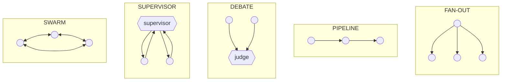

# **Module 8, Lesson 3: Structuring AI Teams**

### Building on What We've Learned

You can now build one reliable agent: a model, a harness, a verified loop. The obvious next move is to build several and have them work together — and this is where a great many 2025–2026 projects went wrong. Industry tracking through 2026 put roughly **40% of multi-agent pilots as failed within six months of production deployment**, usually not because the agents were bad but because the *structure* was.

This lesson covers structure in both senses the phrase implies: **how you arrange agents into teams**, and **how humans arrange themselves around those teams**.

### Learning Objectives

By the end of this lesson, you will be able to:
*   **Explain** the real reason multi-agent systems work — context isolation — and when it doesn't apply.
*   **Select** among the five production orchestration patterns and justify the choice by cost and failure mode.
*   **Design** a handoff contract between a coordinator and its sub-agents.
*   **Describe** how human roles and metrics change on a team that runs agents.

---

### **1. First, Don't**

Multi-agent architecture is expensive. A supervisor with three sub-agents costs roughly **4× a single agent** for the same task, and it adds coordination failure modes that a single agent simply doesn't have.

**Reach for a single agent with a good harness first.** Most "we need a multi-agent system" instincts are really one of these:

| What it feels like | What it usually is | The cheaper fix |
| :--- | :--- | :--- |
| "The agent gets confused between tasks" | Too many overlapping tools | Prune the tool set (Module 5, Lesson 2) |
| "It runs out of context" | No compaction strategy | Add compaction (Module 4, Lesson 4) |
| "It does step 3 before step 2" | Ill-defined goal | Rewrite the goal as a verifiable state (Lesson 2) |
| "One prompt can't hold all the rules" | Prompt at the wrong altitude | Split into skills loaded on demand (Module 5, Lesson 4) |

There is exactly one thing multi-agent architecture gives you that a single agent cannot have, and it's worth stating precisely.

---

### **2. The Real Reason Multi-Agent Works: Context Isolation**

The naïve story is that specialized agents are smarter at their specialty. That's mostly not it — the same model backs all of them.

The actual mechanism is **context isolation**:

> A sub-agent can burn 50,000 tokens exploring a problem in its own context window and return a 1,500-token distilled answer. **The coordinator never sees the 48,500 tokens of exploration.**

This is a compression ratio you cannot achieve any other way. The coordinator's context stays small and clean across a task that consumed hundreds of thousands of tokens in aggregate. Everything you learned about context rot in Module 4 says this is the difference between a coherent long task and a degraded one.

So the design question is not "what roles should my agents have?" It's:

> **"Which parts of this work generate a lot of tokens whose details the coordinator does not need?"**

Those are your sub-agents. Work that *doesn't* fit that description — where the coordinator needs the details anyway — should stay in the main agent, because splitting it just adds cost and a serialization boundary.

---

### **3. The Five Production Patterns**



| Pattern | Shape | Use when | Cost | Signature failure |
| :--- | :--- | :--- | :--- | :--- |
| **Fan-out** | One → many, parallel, independent | Tasks are genuinely independent: search N sources, summarize N chunks | ~N× (parallel wall-clock) | **Partial-failure ambiguity** — branch 3 dies; nobody specified whether to fail, degrade, or retry |
| **Pipeline** | Stage → stage → stage | Each stage needs the previous one's output: research → draft → critique → revise | ~N× (latency compounds) | **Cascade poisoning** — a bad stage-2 output corrupts every stage after it |
| **Debate** | Many → judge | High-stakes calls where independent perspectives genuinely differ | ~1.2×–2.5× | **Judge bias** — the judge reliably prefers one agent's *style* over the other's *correctness* |
| **Supervisor** | Coordinator delegates and aggregates | Cross-domain work needing different specialists. **The 2026 default.** | ~(N+1)× | **Over-delegation** — subtasks sliced too thin to complete, causing reallocation loops |
| **Swarm** | Peers, no central controller | 50+ genuinely parallel tasks with an unpredictable workload | Unbounded without caps | **Population explosion**; shared-state races |

**Practical guidance:**

*   **Start with supervisor.** Add fan-out branches beneath it only where subtasks are provably independent. This covers the large majority of real systems.
*   **Team size: 3–7 agents.** Below three, you probably didn't need a team. Above seven, coordination overhead starts eating the specialization benefit.
*   **Don't reach for swarm at small scale.** For 3–10 concurrent agents, a supervisor with fan-out branches is simpler, cheaper, and vastly more debuggable.
*   **Check your framework's nesting limits before designing.** Several mainstream SDKs allow sub-agents exactly one level deep — sub-agents cannot spawn sub-agents. A three-tier hierarchy on paper becomes a rewrite in practice.

**Per-pattern mitigations worth building in from the start:**
*   *Fan-out:* declare the aggregation policy explicitly — `fail_fast`, `best_effort`, or `retry_failed_only`.
*   *Pipeline:* validate at every stage boundary. A schema check between stages costs nothing and stops cascades.
*   *Debate:* cap the arbitration rounds, and have the judge score against a **written rubric** rather than "pick the better one."
*   *Supervisor:* give subtasks a minimum size, and have the supervisor reject a returned result that doesn't match the contract rather than silently re-delegating.

---

### **4. The Handoff Contract**

Most multi-agent failures are handoff failures. The coordinator's mental model of what the sub-agent did diverges from what it actually did, and nothing catches it.

Fix that with an explicit contract, specified before you write the prompts:

```python
SUBAGENT_CONTRACT = {
    "name": "codebase_researcher",

    # What it may see. Everything else is invisible to it.
    "inputs": {
        "question":  "str — one specific question, not a topic",
        "scope":     "list[str] — path globs it may read",
    },

    # What crosses back. Enforced by schema, not by hope.
    "returns": {
        "answer":     "str — ≤ 300 words",
        "citations":  "list[{path, line_range}] — every claim must have one",
        "confidence": "'high' | 'medium' | 'low'",
        "gaps":       "list[str] — what it could not determine",
    },

    # Hard limits, enforced by the harness.
    "permissions":    ["read:src/**", "read:docs/**"],   # no writes, no network
    "max_tokens":     60_000,
    "max_tool_calls": 40,
}
```

Four rules make handoffs survivable:

1.  **Ask a question, not a topic.** "Research authentication" returns an essay. "Which module validates the session cookie, and where is its expiry set?" returns an answer.
2.  **Return structure, not prose.** A schema lets the coordinator detect a bad result programmatically. Prose lets a bad result pass silently into the next stage.
3.  **Make the `gaps` field mandatory.** Sub-agents that can't say "I couldn't determine X" will invent X instead. An explicit slot for uncertainty is one of the cheapest hallucination defenses in a multi-agent system.
4.  **Scope permissions per sub-agent, not per system.** A researcher gets read-only. Only the one agent that needs to write gets write. This is least privilege, and it's also what keeps a prompt-injected sub-agent from being able to do anything (Module 6, Lesson 3).

---

### **5. Structuring the Human Side**

The other half of "structuring AI teams" is the org chart around them. Teams that run agents at scale have converged on some recognizable roles and metric changes.

**Roles that appeared:**

*   **Agent supervisor / HITL reviewer.** The person who owns the approval gates — typically the domain expert whose judgment the agent is approximating. Their day shifts from *producing* the artifact to *adjudicating* the ones the agent produces above a risk threshold.
*   **Eval owner.** Someone owns the definition of "good output" for each agent, and owns the eval set that encodes it. Without a named owner, eval suites rot within a quarter and nobody notices the agent regressed.
*   **Harness / platform engineer.** Owns the shared runtime: tool registry, permission model, sandboxing, tracing, cost controls. This is where platform teams landed — standardizing *how* agents run so every product team doesn't rebuild Layer 4 badly.

**What changes for engineers.** The commonly reported shape is a smaller core of senior engineers plus a fleet of agents, with the scarce skill moving from *writing* code to *specifying and verifying* it. The career-ladder implication that teams are actively wrestling with: juniors historically learned by writing the code that agents now write, so deliberate paths from "code generator" to "system verifier" have to be designed rather than assumed.

**What changes for measurement.** Output volume becomes a nearly meaningless metric — agents can generate unlimited plausible work. The metrics that survived are ones that measure *value that stuck*:

| Metric | What it catches |
| :--- | :--- |
| Cost per merged PR | Whether agent spend converts into shipped work |
| First-pass success rate | Whether the harness is good, or humans are quietly fixing everything |
| Code survival rate | Whether agent output lasts, or gets rewritten next sprint |
| Review churn per unit of change | Whether "faster to produce" became "slower to accept" |
| Escalation rate | Whether autonomy levels are set correctly |

> **Pro-Tip: Autonomy is a dial, not a switch**
> Give each agent an explicit autonomy level, and raise it on evidence. *Level 1:* proposes, human executes. *Level 2:* executes in a sandbox, human approves the diff. *Level 3:* executes autonomously, human reviews after the fact. *Level 4:* fully autonomous with sampled audits. Promote an agent a level only when its first-pass success rate and escalation rate justify it — and be equally willing to demote it after a bad week.

---

### **Key Takeaways**

*   **Try a single well-harnessed agent first.** Multi-agent costs ~N× and adds coordination failure modes; most instincts toward it are really unsolved single-agent problems.
*   Multi-agent works because of **context isolation** — a sub-agent spends 50k tokens and returns 1.5k. Design sub-agents around token-heavy work whose details the coordinator doesn't need.
*   Five patterns cover production: **fan-out, pipeline, debate, supervisor, swarm.** Supervisor is the default; each has a signature failure mode to design against.
*   Most multi-agent bugs are **handoff bugs.** Specify an explicit contract: narrow question in, schema out, mandatory `gaps` field, per-sub-agent permissions.
*   Human structure changes too: **agent supervisor, eval owner, harness/platform engineer** — and metrics move from output volume to **value that survived review.**

### **Hands-On Task: Structure a Team**

**Part A — Pattern selection.** For each scenario, choose a pattern (or "single agent"), and justify it in two sentences naming the cost you're accepting and the failure mode you'll design against.

1.  **Quarterly compliance review.** Read 400 vendor contracts and flag any with an auto-renewal clause shorter than 30 days' notice. Each contract is independent.
2.  **Incident postmortem.** Given an incident ID, pull logs, traces, the deploy history, and the on-call chat, then produce a timeline and a root-cause hypothesis. Each source informs which source to check next.
3.  **Architecture decision.** Choose between three database options for a new service. The decision is expensive to reverse and reasonable engineers disagree.
4.  **Migrating a 900-file codebase** from one test framework to another. Files are mostly independent, but a shared helper module must be migrated first.

**Part B — Handoff contract.** For scenario 2, write the full contract for one sub-agent using the template in section 4. Include `inputs`, `returns` (with a `gaps` field), `permissions`, and limits.

**Part C — The demotion.** Your PR-fixing agent has run at Level 3 (autonomous execution, human reviews after) for two months. Last week its first-pass success rate dropped from 78% to 51%. Nothing in the harness changed; the underlying model was upgraded.

Write the three-step response: what you check first, what you change immediately, and what you'd add to prevent this from being noticed a week late next time.
