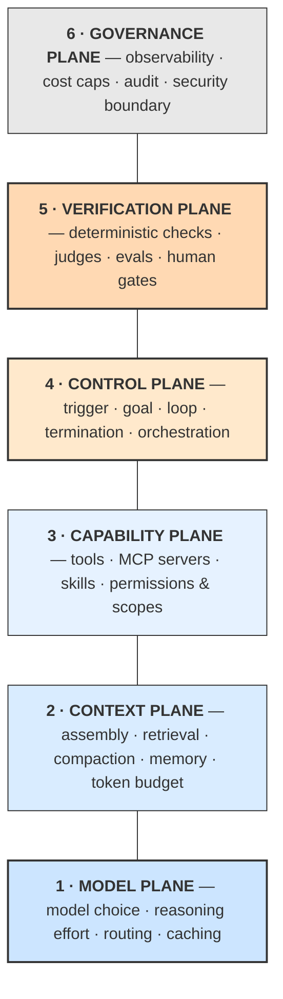

# **Module 8, Lesson 4: A Unifying Blueprint — Agentic Architecture**

### Building on What We've Learned

Every technique in this course has now been introduced: prompting, RAG, compression, re-ranking, compaction, memory, tools, MCP, skills, loops, harnesses, orchestration, evaluation, and security. This final lesson organizes them into a single blueprint you can design against, review, and hand to a colleague.

> **A note on what this replaces.** Earlier editions of this course ended with **Context Window Architecture (CWA)** — an 11-layer stack describing the ideal ordering of a single prompt. That model has been retired here. It answered a 2023-shaped question ("how should I arrange one prompt?") and agents don't have one prompt. They assemble context dozens of times per task, across sub-agents with separate windows, over sessions that outlive any single window. What survives from CWA is its central insight — *context assembly is a deliberate design act, not string concatenation* — and it appears below as one plane of a larger model, updated for caching and agent loops.

### Learning Objectives

By the end of this lesson, you will be able to:
*   **Describe** the six planes of an agentic architecture and what each one owns.
*   **Apply** the cache-aware context assembly rule and explain why ordering still matters.
*   **Map** every technique in this course to the plane it belongs to.
*   **Write** a one-page architecture specification for an agentic system.

---

### **1. The Six Planes**

An agentic system is not a prompt with extras bolted on. It's a runtime, and like any runtime it separates into planes with distinct concerns, distinct owners, and distinct failure modes.



**Plane 1 — Model.** Which model runs which step, and with how much reasoning effort. In 2026 this is a real design decision rather than a default: routing cheap classification to a small model and hard synthesis to a frontier model is often the single largest cost lever in the system. Also decided here: whether a step uses extended thinking, and where your cache breakpoints sit.

**Plane 2 — Context.** What enters the window on each turn, and what leaves. Retrieval strategy, ranked and compressed results, compaction thresholds, durable memory reads and writes, and the token budget that governs all of it. *This is the plane the first half of this course was about.*

**Plane 3 — Capability.** What the agent can do: the tool set and its schemas, MCP servers, skills loaded on demand, and — inseparably — the **permission scope of each capability**. A tool and its authorization are one design object; splitting them is how the lethal trifecta gets built by accident.

**Plane 4 — Control.** The loop. Trigger, goal, planning, iteration, termination, and (in multi-agent systems) orchestration pattern and handoff contracts.

**Plane 5 — Verification.** Everything that decides whether output is acceptable: deterministic checks inside the loop, judge models, the offline eval suite, and human approval gates.

**Plane 6 — Governance.** Traces, token accounting, audit logs, cost ceilings, and the security boundary — sandboxing, egress rules, and blast-radius limits.

**Why these boundaries.** Each plane fails in its own way and is fixed by its own kind of change. When an agent misbehaves, naming the plane is most of the diagnosis:

| Symptom | Plane | Typical fix |
| :--- | :--- | :--- |
| Confidently wrong facts | Context (2) | Retrieval quality, grounding rules, citations |
| Picks the wrong tool | Capability (3) | Prune overlapping tools; sharpen descriptions |
| Never finishes / finishes too early | Control (4) | Rewrite the goal as a verifiable state |
| Claims success falsely | Verification (5) | External check gates termination |
| Degrades late in long tasks | Context (2) | Compaction, sub-agent isolation |
| Costs 10× the estimate | Model (1) + Governance (6) | Routing, cache-aware ordering, budget caps |
| Did something it shouldn't be able to do | Capability (3) + Governance (6) | Scope permissions, sandbox, egress control |

---

### **2. Cache-Aware Context Assembly**

Ordering still matters — but for two reasons now, not one.

**Reason 1: attention.** Models attend most reliably to the beginning and end of the window and least reliably to the middle (Module 4, Lesson 1). Critical instructions go first; the immediate task goes last.

**Reason 2: caching.** Prompt caching bills cache reads at roughly a tenth of normal input, but a cache prefix is only valid up to the **first byte that changed**. If a timestamp sits near the top of your prompt, you invalidate everything after it on every single call — and pay full price for a context you thought was cached. In a multi-turn agent loop, where the same system prompt anchors hundreds of calls, getting this backwards is one of the most expensive mistakes available.

Both reasons point the same direction, which is convenient. **Order from most stable to most volatile:**

```
┌─ STABLE — cached across the whole session, high primacy attention ───┐
│  1. System instructions: role, rules, output contract               │
│  2. Tool + skill definitions                                        │
│  3. Canonical few-shot examples                                     │
│  4. Durable memory: project conventions, learned preferences        │
├─ ◆ CACHE BREAKPOINT ────────────────────────────────────────────────┤
│  5. Compacted history summary (changes only on compaction)          │
├─ ◆ CACHE BREAKPOINT ────────────────────────────────────────────────┤
│  6. Retrieved documents, ranked and compressed                      │
│  7. Recent turns and tool results                                   │
├─ VOLATILE — never cached, high recency attention ───────────────────┤
│  8. Current task state / plan-and-progress                          │
│  9. The immediate instruction or user query                         │
└─────────────────────────────────────────────────────────────────────┘
```

Three rules follow from this layout, and they're worth memorizing:

*   **Never put anything volatile above anything stable.** A timestamp, a request ID, or a session counter placed at position 1 costs you the entire cache.
*   **Put the task last, always.** After the model has processed everything above, the final tokens re-focus it on what it's actually supposed to do right now.
*   **The middle is the cheap seats.** If something absolutely must be attended to, it does not belong in positions 5–7. Restate it at position 9 if it matters.

> **This is the surviving core of CWA.** Not eleven fixed layers, but one principle: context assembly is a deliberate, ordered, budgeted design act. What changed is that it's now performed *by code, on every turn*, and it has to be cheap as well as effective.

---

### **3. Mapping the Course**

Every technique you've learned, filed under its plane:

| Plane | Techniques | Where taught |
| :--- | :--- | :--- |
| **1 · Model** | Model routing, reasoning effort, prompt caching, cost/latency trade-offs | M1 L2, M2 L3 |
| **2 · Context** | Four pillars, altitude, structure & delimiters, RAG, chunking, hybrid search, agentic retrieval, re-ranking, compression, compaction, note-taking, sub-agent isolation, JIT retrieval | M1–M4 |
| **3 · Capability** | Tool schemas, description quality, MCP servers, Agent Skills, progressive disclosure, permission scopes | M5 L2, M5 L4 |
| **4 · Control** | ReAct, Plan-and-Execute, reset loops, goal verification, termination, orchestration patterns, handoff contracts | M5 L1, M5 L3, M8 L2, M8 L3 |
| **5 · Verification** | Context precision/recall, faithfulness, answer relevance, trajectory evals, LLM-as-judge, natural-language unit tests, human gates | M6 L1, M8 L2 |
| **6 · Governance** | Tracing, OpenTelemetry GenAI conventions, cost accounting, prompt injection defense, least privilege, sandboxing, safety benchmarks | M6 L2, M6 L3 |

If a plane in your own system is blank, that's not simplicity — it's an unowned concern. Blank Verification means you're trusting self-reports. Blank Governance means your first incident will be undiagnosable.

---

### **4. The One-Page Architecture Spec**

Before writing agent code, fill this in. It takes twenty minutes and it is the single highest-return document in an agentic project — because every line of it is a decision that is expensive to change later and cheap to decide now.

```markdown
# Agent: <name>
**Job:** <one sentence — what it accomplishes, for whom>
**Autonomy level:** <1 proposes | 2 sandboxed+approved | 3 autonomous+reviewed | 4 audited>

## 1. Model
- Primary model / reasoning effort:
- Cheaper model for <which steps>:
- Cache breakpoints after:

## 2. Context
- Assembly order (stable → volatile):
- Retrieval strategy:            # vector / hybrid / agentic search / none
- Compaction trigger + what is preserved verbatim:
- Durable memory: what is written, when, where:
- Token budget per turn / per run:

## 3. Capability
| Tool / skill | Purpose | Permission scope | Failure mode returned to agent |
|---|---|---|---|
- Explicitly NOT given: <and why>

## 4. Control
- Trigger:
- Goal (a verifiable end state):
- Loop pattern:
- Orchestration + handoff contracts (if multi-agent):
- Termination: iteration cap / token cap / no-progress / circuit breaker

## 5. Verification
- In-loop check (tier 1/2/3):
- Offline eval set: size, how built, who owns it
- Human gates: which actions, who approves

## 6. Governance
- Traces emitted:
- Cost ceiling per run + what happens at the ceiling:
- Untrusted input enters at:        # ← be honest here
- Blast radius if fully compromised:
```

> **The two lines people skip.** "Explicitly NOT given" and "Untrusted input enters at." Both are the difference between a system whose limits you designed and one whose limits you'll discover. If your agent reads untrusted content, holds private data, *and* can act outward, you have built the lethal trifecta — go back to Module 6, Lesson 3 and remove one leg.

---

### **5. How to Grow a System Through the Planes**

Real systems aren't built by filling in six planes at once. They're built in a sequence that lets you find out you were wrong cheaply.

1.  **Start with the narrowest useful agent.** One goal, three tools, no memory, human-triggered, human-reviewed. Ship it.
2.  **Add Verification before adding capability.** You cannot tell whether change #4 helped without an eval set. Teams that add evals late spend months unable to answer "is it better?"
3.  **Add Context sophistication when you can measure the need.** Don't add re-ranking because it's in the course; add it because your context precision score says retrieval is noisy.
4.  **Raise autonomy on evidence.** Level 1 → 2 → 3 only when first-pass success and escalation rates justify it.
5.  **Split into sub-agents only when context isolation is the actual bottleneck** — not when the org chart is contagious.
6.  **Govern before you scale.** Traces and cost caps are cheap at three agents and urgent at thirty.

The order matters because each step makes the next one falsifiable. That's the whole discipline, really: **build systems where being wrong is detectable and cheap.**

---

### **Key Takeaways**

*   An agentic system separates into six planes: **Model, Context, Capability, Control, Verification, Governance.** Each fails distinctly and is fixed distinctly — naming the plane is most of the diagnosis.
*   **Cache-aware context assembly** replaces the fixed-layer prompt stack: order stable → volatile, so attention *and* caching both work in your favor. Never put a volatile token above a stable one.
*   The surviving idea from Context Window Architecture is that **context assembly is a deliberate design act** — now performed by code, on every turn, under a budget.
*   A blank plane is an **unowned concern**, not a simplification.
*   Write the **one-page spec before the code**, and be honest in the two lines about what the agent is denied and where untrusted input enters.
*   Grow through the planes in an order that keeps **being wrong cheap and detectable**.

### **Final Task: Specify Your Architecture**

Take the system you're building for the **Final Project** — or any agent you'd genuinely like to exist — and fill in the complete one-page spec from section 4.

Then answer these four questions about what you wrote:

1.  **Which plane is thinnest?** Is that a deliberate scoping decision or an unowned concern? Say which, in one sentence.
2.  **Trace a failure.** Pick a plausible way your agent produces a bad outcome. Walk it back to a plane. Name the specific change that prevents recurrence — and confirm it's a structural change, not a wording change.
3.  **Do you have the trifecta?** Untrusted input + private data + outward action. If yes, which leg do you remove, and what does the agent lose?
4.  **Justify the autonomy level.** What evidence would you need before promoting it one level? What would make you demote it?

If you can answer all four, you're no longer prompting a model. You're architecting a system — which is what this whole course was building toward.
